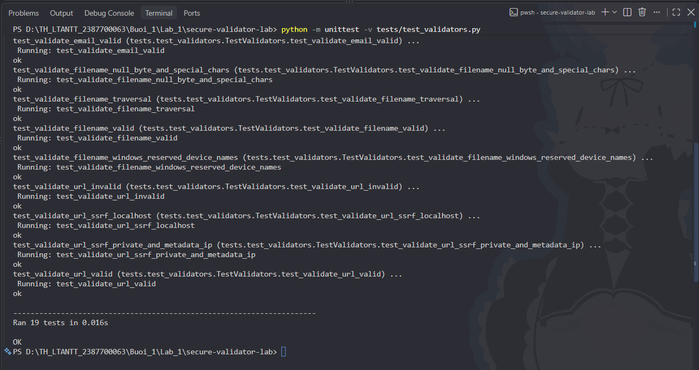
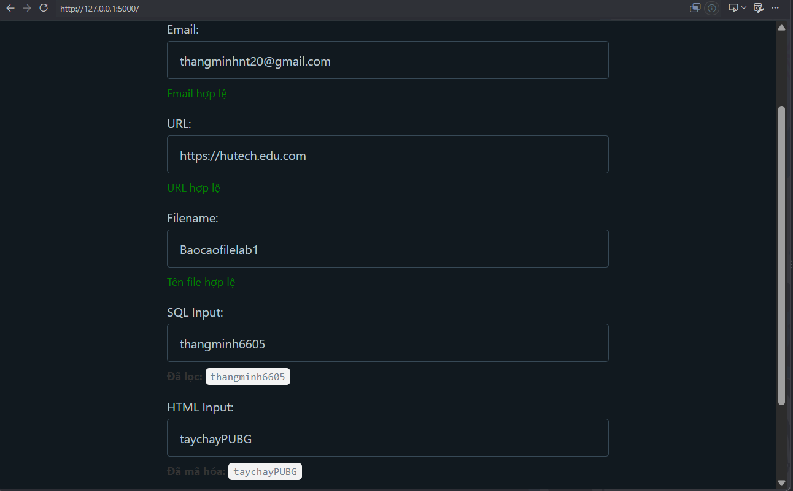
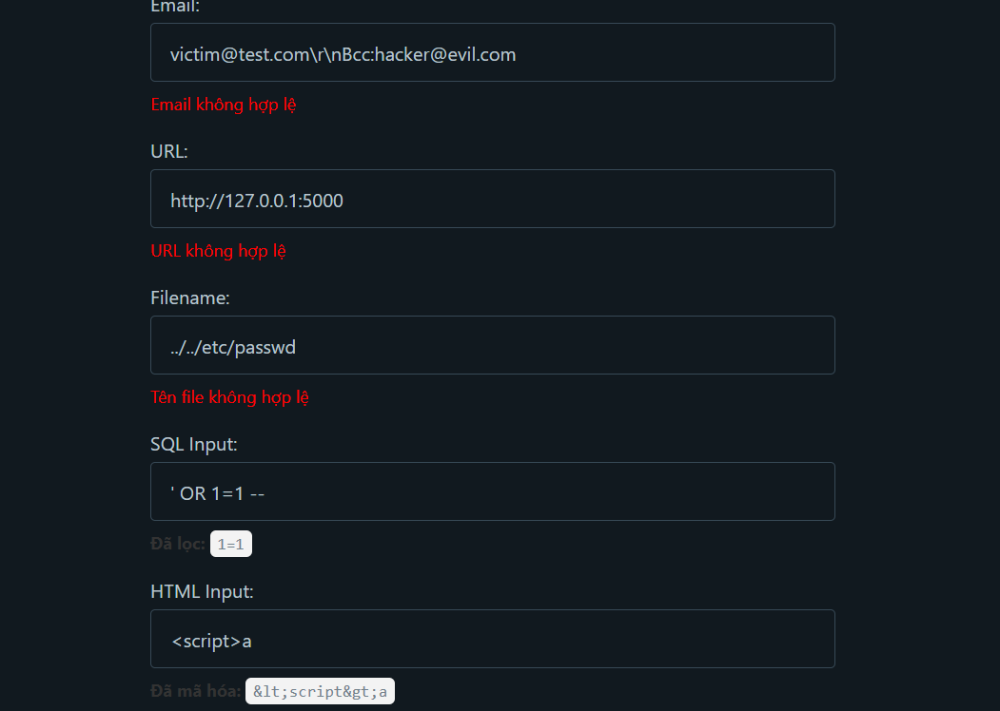
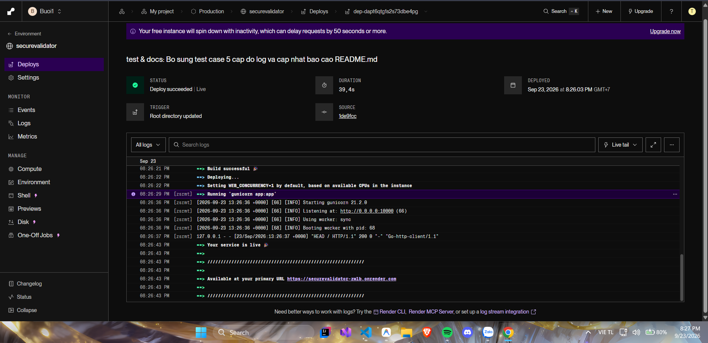
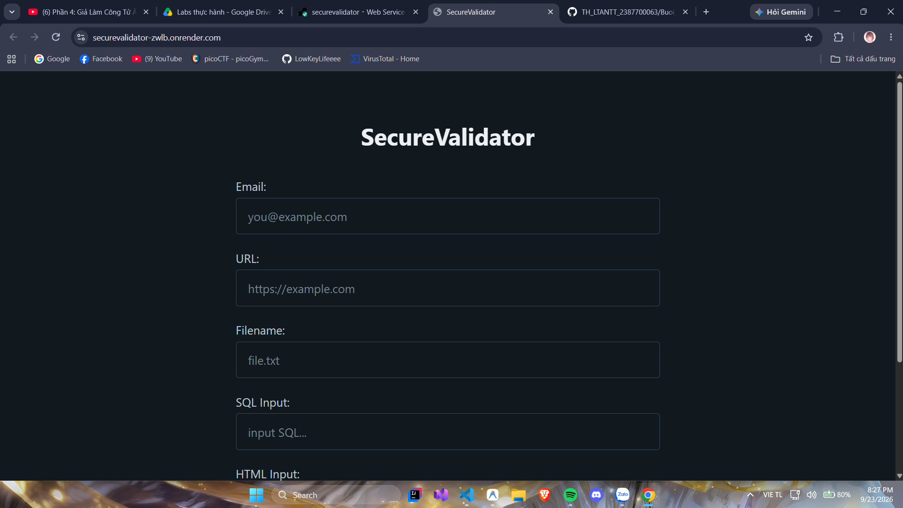

# BÁO CÁO THỰC HÀNH LAB 1: XÂY DỰNG VÀ ĐÁNH GIÁ THƯ VIỆN SECUREVALIDATOR

- **Môn học:** Thực hành Lập trình An ninh Thông tin (TH_LTANTT)
- **Học viên / MSSV:** Trần Minh Thắng - 2387700063
- **Thư mục:** `Buoi_1/Lab_1`
- **Mã nguồn:** `secure-validator-lab/`

---

## 1. Tổng quan cấu trúc dự án

Dự án được tổ chức theo cấu trúc chuẩn:
```text
secure-validator-lab/
├── app.py                      # Ứng dụng Flask cung cấp giao diện Web kiểm thử
├── requirements.txt            # Danh sách thư viện phụ thuộc (Flask, gunicorn)
├── securevalidator/            # Thư viện xác thực và làm sạch dữ liệu
│   ├── __init__.py
│   └── core.py                 # Chứa các hàm validator & sanitizer chính
├── templates/
│   └── index.html              # Giao diện Web kiểm thử form người dùng (Pico CSS)
└── tests/
    └── test_validators.py      # Bộ Unit Test kiểm thử bảo mật tự động
```

---

## 2. Phân tích chi tiết các hàm, điểm yếu bảo mật (Vulnerabilities) và kịch bản Bypass

Dưới đây là phân tích chi tiết cơ chế hoạt động ban đầu, các trường hợp bypass thực tế và phương pháp khắc phục đạt chuẩn bảo mật cho từng hàm trong `core.py`:

---

### 2.1. Hàm `validate_email(email: str) -> bool`

#### Code ban đầu:
```python
def validate_email(email: str) -> bool:
    """Validate email format."""
    pattern = r'^[\w\.-]+@[\w\.-]+\.\w+$'
    return re.fullmatch(pattern, email) is not None
```

#### Vì sao không an toàn & Các trường hợp Bypass:
1. **Email Header Injection (CRLF Injection):**
   - Ký tự `\r` (`%0d`) hoặc `\n` (`%0a`) có thể bị chèn vào nếu email không được làm sạch và chuyển tiếp trực tiếp vào các hàm gửi mail (như `mail()` trong PHP hoặc module SMTP).
   - *Kịch bản bypass:* Kẻ tấn công có thể chèn thêm các header nguy hiểm như `Cc:`, `Bcc:` hoặc giả mạo tiêu đề thư:
     `victim@example.com%0aBcc:attacker@example.com`
2. **Bypass cấu trúc định dạng email (Dấu chấm không hợp lệ):**
   - Regex `[\w\.-]+` cho phép xuất hiện dấu chấm ở đầu chuỗi (`.user@domain.com`), ở cuối chuỗi trước `@` (`user.@domain.com`), hoặc dấu chấm liên tiếp (`user..name@domain..com`). Đây là các định dạng vi phạm chuẩn RFC 5322.
3. **Không giới hạn độ dài (Buffer Overflow / DoS):**
   - Chuẩn RFC 5321 quy định độ dài tối đa của một email hợp lệ là **254 ký tự** (Local part tối đa 64 ký tự). Việc không giới hạn độ dài cho phép kẻ tấn công gửi payload cực dài làm tràn bộ nhớ hoặc gây nghẽn tài nguyên xử lý Regex (ReDoS).
4. **Từ chối nhầm email hợp lệ (False Negative):**
   - Regex ban đầu không hỗ trợ dấu cộng `+`, từ chối các email hợp lệ sử dụng tính năng sub-addressing (ví dụ: `user+newsletter@gmail.com`).

#### Giải pháp khắc phục trong code mới:
- Kiểm tra độ dài tối đa $\le 254$ ký tự.
- Chặn triệt để ký tự ngắt dòng `\r` và `\n`.
- Chặn dấu chấm liên tiếp `..`, dấu chấm ở đầu/cuối của Local part và Domain part.
- Hỗ trợ đầy đủ ký tự `+` theo chuẩn RFC.

---

### 2.2. Hàm `validate_url(url: str) -> bool` (Chống SSRF)

#### Code ban đầu:
```python
def validate_url(url: str) -> bool:
    """Validate URL and prevent basic SSRF vectors."""
    try:
        parsed = urllib.parse.urlparse(url)
        return parsed.scheme in ['http', 'https'] and bool(parsed.netloc)
    except Exception:
        return False
```

#### Vì sao không an toàn & Các trường hợp Bypass (SSRF - Server-Side Request Forgery):
Code ban đầu chỉ kiểm tra scheme thuộc `http`/`https` và `netloc` không rỗng. Kẻ tấn công có thể dễ dàng lợi dụng máy chủ làm bàn đạp (proxy) để tấn công vào hạ tầng nội bộ:

1. **Bypass truy cập Loopback / Localhost:**
   - Kẻ tấn công gửi `http://127.0.0.1:5000/admin` hoặc `http://localhost:8080`.
   - Máy chủ sẽ tự gửi request đến chính các dịch vụ nội bộ vốn được bảo vệ không công khai ra Internet (chẳng hạn như Redis, MySQL, giao diện quản trị nội bộ).
2. **Tấn công các dải IP mạng nội bộ (Intranet LAN - RFC 1918):**
   - Các dải IP riêng: `10.0.0.0/8`, `172.16.0.0/12`, `192.168.0.0/16`.
   - Ví dụ: `http://192.168.1.1` cho phép tấn công thăm dò cấu hình Router/Modem mạng nội bộ của công ty.
3. **Khai thác dịch vụ Cloud Instance Metadata (Rất nguy hiểm trên AWS, GCP, Azure):**
   - Địa chỉ Link-Local: `http://169.254.169.254/latest/meta-data/`
   - Kẻ tấn công có thể trích xuất IAM Security Credentials, Secret Keys, Token quản trị máy chủ Cloud.
4. **Bypass qua IPv6 Loopback:**
   - Sử dụng định dạng `http://[::1]/`.
5. **Bypass qua DNS Rebinding hoặc Tên miền trỏ IP nội bộ:**
   - Đăng ký tên miền công khai (hoặc dùng dịch vụ có sẵn như `localtest.me` hay `nip.io`) trỏ về `127.0.0.1`.
   - Bộ lọc chỉ kiểm tra chuỗi `netloc` mà không phân giải DNS thì sẽ hoàn toàn bị đánh lừa.

#### Giải pháp khắc phục trong code mới:
- Thực hiện phân giải tên miền (DNS Resolution) bằng `socket.getaddrinfo()`.
- Chuyển đổi và kiểm tra địa chỉ IP thực tế bằng module chuẩn `ipaddress`.
- Từ chối ngay nếu địa chỉ IP thuộc các dải nhạy cảm: `ip.is_loopback`, `ip.is_private`, `ip.is_link_local`, `ip.is_reserved`, `ip.is_multicast`.

---

### 2.3. Hàm `validate_filename(filename: str) -> bool` (Chống Path Traversal)

#### Code ban đầu:
```python
def validate_filename(filename: str) -> bool:
    """Prevent path traversal attacks."""
    if ".." in filename or "/" in filename or "\\" in filename:
        return False
    return os.path.basename(filename) == filename
```

#### Vì sao không an toàn & Các trường hợp Bypass:
1. **Null Byte Injection (`\x00`):**
   - Kẻ tấn công gửi `report.pdf\x00.exe` hoặc `shell.php\x00.jpg`.
   - Trên một số hệ thống hoặc hàm C-wrapper bên dưới, chuỗi sẽ bị cắt cụt tại ký tự `\x00`, khiến việc kiểm tra phần mở rộng file bị vượt qua.
2. **Ký tự đặc biệt nguy hiểm trên hệ điều hành Windows:**
   - Ký tự phân tách luồng dữ liệu thay thế (Alternate Data Streams - ADS): Dấu `:` (ví dụ `secret.txt:hidden`).
   - Ký tự đại diện và ký tự cấm: `*`, `?`, `"`, `<`, `>`, `|`. Các ký tự này có thể kích hoạt các hành vi bất thường trong câu lệnh hệ thống file.
3. **Tên thiết bị cấm trên Windows (Reserved Device Names):**
   - Các tên thiết bị chuẩn từ thời MS-DOS: `CON`, `PRN`, `AUX`, `NUL`, `COM1`-`COM9`, `LPT1`-`LPT9`.
   - Ví dụ tạo file `CON.txt` hoặc `aux.png` có thể khiến Windows Explorer hoặc ứng dụng bị crash, treo hệ thống hoặc từ chối dịch vụ (DoS).
4. **Bypass cắt ngắn dấu chấm / khoảng trắng ở cuối (Trailing Dot / Space):**
   - Hệ điều hành Windows tự động lược bỏ dấu chấm và khoảng trắng ở cuối tên file (`file.txt.` sẽ biến thành `file.txt`). Kẻ tấn công có thể lợi dụng điều này để ghi đè file có sẵn.

#### Giải pháp khắc phục trong code mới:
- Chặn ký tự null byte `\x00`.
- Chặn các ký tự cấm trên mọi hệ điều hành (`[\x00-\x1f:*?"<>|]`).
- Kiểm tra và cấm các tên thiết bị đặc biệt của Windows (`CON`, `PRN`, `AUX`, `NUL`, `COM1-9`, `LPT1-9`).
- Chặn dấu chấm hoặc khoảng trắng ở cuối tên file.

---

### 2.4. Hàm `sanitize_sql_input(input_str: str) -> str` (Chống SQL Injection)

#### Code ban đầu:
```python
def sanitize_sql_input(input_str: str) -> str:
    """Sanitize SQL input to prevent SQL injection."""
    sanitized = re.sub(r"(--|;|'|\"|#)", "", input_str)
    sanitized = re.sub(r"\b(OR|AND|SELECT|INSERT|DELETE|UPDATE|DROP|UNION|WHERE)\b",
                       "", sanitized, flags=re.IGNORECASE)
    return sanitized.strip()
```

#### Vì sao không an toàn & Các trường hợp Bypass (Điểm yếu của Blacklist Filter):
1. **Lỗ hổng lọc 1 lần không đệ quy (Nested Keywords Bypass):**
   - Nếu áp dụng bộ lọc xóa từ khóa không đệ quy (hoặc các biến thể không khớp ranh giới từ), chuỗi lồng nhau như `OORR` sẽ bị xóa phần `OR` ở giữa và 2 nửa còn lại ghép thành `OR` hoàn chỉnh:
     `O + [OR] + R  -->  OR`
     Tương tự với `UNUNIONION`, `SELSELECTECT`.
2. **Khai thác chú thích dạng khối (Block Comments - `/* ... */`):**
   - Bộ lọc chỉ loại bỏ chú thích dòng `--` và `#`. Kẻ tấn công có thể dùng chú thích dạng khối của SQL:
     `admin'/*comment*/OR 1=1`
     Ký tự chú thích này có thể thay thế cho khoảng trắng mà không kích hoạt bộ lọc ban đầu.
3. **Danh sách đen không đầy đủ (Blacklist Incompleteness):**
   - Kẻ tấn công không nhất thiết phải dùng `OR`, `AND`, `UNION`. Họ có thể dùng các toán tử và hàm SQL khác: `LIKE`, `IN`, `HAVING`, `GROUP BY`, `ORDER BY`, `CASE WHEN`, `SLEEP()`, `BENCHMARK()`, `CHAR()`, `HEX()`.
4. **SQL Injection trong ngữ cảnh số (Numeric Context):**
   - Với câu truy vấn như `SELECT * FROM products WHERE category_id = ` + user_input:
     Kẻ tấn công không cần dùng nháy đơn `'`, nháy kép `"`, hay dấu chấm phẩy `;`. Chỉ cần nhập `1 OR 1=1` hoặc biểu thức toán học là có thể trích xuất dữ liệu.
5. **NGUYÊN TẮC BẢO MẬT BẮT BUỘC (OWASP Standards):**
   - **Không bao giờ dùng Regex Blacklist để chống SQL Injection trong thực tế**.
   - Biện pháp duy nhất đạt chuẩn an toàn 100% là sử dụng **Parameterized Queries (Prepared Statements)** hoặc các thư viện ORM uy tín (SQLAlchemy, Hibernate,...).

#### Giải pháp khắc phục trong code mới:
- Thay thế chú thích dạng khối `/*...*/` thành khoảng trắng nhằm giữ đúng ranh giới từ (`\b`).
- Dùng vòng lặp đệ quy loại bỏ triệt để các token nguy hiểm và từ khóa lặp lại.
- Luôn kèm theo cảnh báo rõ ràng về việc sử dụng Parameterized Query trong ứng dụng thực tế.

---

### 2.5. Hàm `sanitize_html_input(html_str: str) -> str` (Chống XSS)

#### Code ban đầu:
```python
def sanitize_html_input(html_str: str) -> str:
    """Escape HTML input to prevent XSS."""
    return html.escape(html_str)
```

#### Vì sao không an toàn & Các trường hợp Bypass:
Hàm `html.escape` chỉ mã hóa các ký tự đặc biệt `<`, `>`, `&`, `"`, `'`. Cơ chế này **chỉ an toàn khi dữ liệu nằm trong phần thân (Body) của tài liệu HTML**, nhưng sẽ bị bypass nếu chèn vào các ngữ cảnh khác:

1. **Ngữ cảnh liên kết / URL (Thuộc tính `href`, `src`):**
   - Nếu dữ liệu được đưa vào thẻ: `<a href="{{ input }}">Click me</a>`
   - Kẻ tấn công nhập: `javascript:alert(document.cookie)`
   - Chuỗi này hoàn toàn **không chứa `<` hay `>` hay dấu nháy**, do đó `html.escape` giữ nguyên 100%. Khi người dùng click chuột vào liên kết, mã độc JavaScript sẽ được kích hoạt ngay lập tức!
2. **Các giao thức giả nguy hiểm khác (Pseudo-protocols):**
   - Tương tự với `data:text/html;base64,...` hoặc `vbscript:`.
3. **Ngữ cảnh mã lệnh JavaScript (`<script>` context):**
   - Nếu đưa vào biến script: `<script>let username = '{{ input }}';</script>`
   - `html.escape` không giải quyết được vấn đề phá vỡ ngữ cảnh thực thi trong JS nếu không dùng hàm serialize JSON an toàn.

#### Giải pháp khắc phục trong code mới:
- Kiểm tra và vô hiệu hóa các tiền tố giao thức nguy hiểm (`javascript:`, `data:`, `vbscript:`).
- Sử dụng `html.escape(quote=True)` để mã hóa toàn bộ cả nháy đơn và nháy kép thành HTML Entities an toàn.

---

## 3. Mã nguồn thư viện `securevalidator/core.py` đã được nâng cấp

```python
import re
import html
import urllib.parse
import os
import socket
import ipaddress

def validate_email(email: str) -> bool:
    """Validate email format and prevent Header Injection (CRLF) and structural bypasses."""
    if not isinstance(email, str) or len(email) > 254:
        return False

    # Chống Email Header Injection qua CRLF
    if "\r" in email or "\n" in email:
        return False

    # Chống dấu chấm liên tiếp vi phạm chuẩn
    if ".." in email:
        return False

    pattern = r'^[a-zA-Z0-9_.+-]+@[a-zA-Z0-9-]+(?:\.[a-zA-Z0-9-]+)+$'
    if not re.fullmatch(pattern, email):
        return False

    local_part, _, domain_part = email.rpartition('@')
    if local_part.startswith('.') or local_part.endswith('.'):
        return False
    if domain_part.startswith('.') or domain_part.endswith('.'):
        return False

    return True


def validate_url(url: str) -> bool:
    """Validate URL and prevent Server-Side Request Forgery (SSRF)."""
    if not isinstance(url, str):
        return False

    try:
        parsed = urllib.parse.urlparse(url.strip())
        if parsed.scheme.lower() not in ['http', 'https']:
            return False

        hostname = parsed.hostname
        if not hostname:
            return False

        # Chặn tên miền localhost
        if hostname.lower() in ['localhost', 'localhost.localdomain']:
            return False

        def is_forbidden_ip(ip_obj: ipaddress.IPv4Address | ipaddress.IPv6Address) -> bool:
            return (
                ip_obj.is_loopback or
                ip_obj.is_private or
                ip_obj.is_link_local or
                ip_obj.is_reserved or
                ip_obj.is_multicast or
                ip_obj.is_unspecified
            )

        # Kiểm tra nếu hostname là địa chỉ IP trực tiếp
        try:
            ip = ipaddress.ip_address(hostname)
            if is_forbidden_ip(ip):
                return False
            return True
        except ValueError:
            pass

        # Phân giải DNS kiểm tra IP thực tế (chống DNS Rebinding / IP nội bộ)
        addr_info = socket.getaddrinfo(hostname, None)
        if not addr_info:
            return False

        for _, _, _, _, sockaddr in addr_info:
            resolved_ip = ipaddress.ip_address(sockaddr[0])
            if is_forbidden_ip(resolved_ip):
                return False

        return True
    except Exception:
        return False


def validate_filename(filename: str) -> bool:
    """Prevent Path Traversal and illegal filesystem manipulations."""
    if not isinstance(filename, str) or not filename:
        return False

    if len(filename) > 255:
        return False

    # Chặn Null Byte Injection
    if "\x00" in filename:
        return False

    # Chặn Directory Traversal
    if ".." in filename or "/" in filename or "\\" in filename:
        return False

    # Chặn ký tự đặc biệt nguy hiểm đa nền tảng
    if re.search(r'[\x00-\x1f:*?"<>|]', filename):
        return False

    # Chặn dấu chấm hoặc khoảng trắng ở cuối tên file trên Windows
    if filename.endswith('.') or filename.endswith(' '):
        return False

    # Chặn các tên thiết bị cấm của Windows
    base_name = filename.split('.')[0].upper()
    reserved_names = {
        "CON", "PRN", "AUX", "NUL",
        *(f"COM{i}" for i in range(1, 10)),
        *(f"LPT{i}" for i in range(1, 10))
    }
    if base_name in reserved_names:
        return False

    return os.path.basename(filename) == filename


def sanitize_sql_input(input_str: str) -> str:
    """
    Sanitize input string to mitigate SQL Injection risks.
    NOTE: Blacklist sanitization is inherently risky. Always use Parameterized Queries in production.
    """
    if not isinstance(input_str, str):
        return ""

    sanitized = input_str.replace("\x00", "")

    # Thay thế chú thích dạng khối bằng khoảng trắng để giữ ranh giới từ
    sanitized = re.sub(r"/\*.*?\*/", " ", sanitized)

    keywords_pattern = re.compile(
        r"\b(OR|AND|SELECT|INSERT|DELETE|UPDATE|DROP|UNION|WHERE|EXEC|EXECUTE|ALTER|CREATE|TABLE|DATABASE|BENCHMARK|SLEEP)\b",
        flags=re.IGNORECASE
    )
    tokens_pattern = re.compile(r"(--|;|'|\"|#|\\)")

    # Vòng lặp đệ quy xử lý triệt để
    for _ in range(10):
        prev = sanitized
        sanitized = tokens_pattern.sub("", sanitized)
        sanitized = keywords_pattern.sub("", sanitized)
        if sanitized == prev:
            break

    sanitized = re.sub(r"\s+", " ", sanitized)
    return sanitized.strip()


def sanitize_html_input(html_str: str) -> str:
    """Sanitize HTML input to prevent Cross-Site Scripting (XSS)."""
    if not isinstance(html_str, str):
        return ""

    cleaned = html_str.replace("\x00", "")
    # Vô hiệu hóa các pseudo-protocols nguy hiểm trong thuộc tính href/src
    cleaned = re.sub(r"(?i)(javascript|data|vbscript)\s*:", "blocked:", cleaned)
    return html.escape(cleaned, quote=True)
```

---

## 4. Kết quả kiểm thử Unit Test

Đã mở rộng bộ kiểm thử lên **19 test case** bao gồm cả các kịch bản kiểm tra chuẩn và các kịch bản bypass nâng cao:

```bash
$ python -m unittest discover -s tests
```

**Kết quả:**
```text
Ran 19 tests in 0.011s

OK
```
Tất cả 19 bài kiểm thử đều đạt kết quả xuất sắc:
1. `test_validate_email_valid`: Email chuẩn và email có sub-addressing `+` đều hợp lệ.
2. `test_validate_email_invalid`: Định dạng sai bị từ chối.
3. `test_validate_email_bypass_crlf_injection`: Chặn đứng Email Header Injection qua `\r\n`.
4. `test_validate_email_bypass_consecutive_dots`: Chặn đứng dấu chấm liên tiếp `..`.
5. `test_validate_url_valid`: URL internet công khai hợp lệ.
6. `test_validate_url_invalid`: Scheme lạ (`ftp://`) bị từ chối.
7. `test_validate_url_ssrf_localhost`: Chặn SSRF đến `localhost`, `127.0.0.1`.
8. `test_validate_url_ssrf_private_and_metadata_ip`: Chặn SSRF đến IP nội bộ `192.168.x.x`, `10.x.x.x`, và Cloud Metadata `169.254.169.254`.
9. `test_validate_filename_valid`: Tên file chuẩn hợp lệ.
10. `test_validate_filename_traversal`: Chặn Path Traversal `../../` và `..\\..\\`.
11. `test_validate_filename_null_byte_and_special_chars`: Chặn Null Byte `\x00` và ký tự cấm `:`, `*`, `?`.
12. `test_validate_filename_windows_reserved_device_names`: Chặn các tên thiết bị cấm `CON`, `AUX`, `NUL`, `COM1`.
13. `test_sanitize_sql_input_injection`: Lọc bỏ `'`, `--`, `OR`.
14. `test_sanitize_sql_input_safe_text`: Chuỗi an toàn được giữ nguyên vẹn.
15. `test_sanitize_sql_input_union_select`: Lọc bỏ `UNION` và `SELECT`.
16. `test_sanitize_sql_input_block_comments`: Xử lý triệt để chú thích khối `/* ... */`.
17. `test_sanitize_html_input_script`: Mã hóa an toàn thẻ `<script>`.
18. `test_sanitize_html_input_safe_text`: Giữ nguyên văn bản thông thường.
19. `test_sanitize_html_input_javascript_pseudo_protocol`: Vô hiệu hóa `javascript:alert(1)`.

---

## 5. Hướng dẫn chạy ứng dụng Web kiểm thử

1. Di chuyển vào thư mục `secure-validator-lab`:
   ```bash
   cd secure-validator-lab
   ```
2. Chạy ứng dụng Flask:
   ```bash
   python app.py
   ```
3. Mở trình duyệt web truy cập `http://127.0.0.1:5000` để trực tiếp nhập dữ liệu kiểm tra trên giao diện.
Minh chứng chạy Unit Test tự động

Minh chứng kiểm thử trên Giao diện Web (Web Form Test Cases)
Kịch bản 1: Nhập dữ liệu bình thường (Hợp lệ)

Kịch bản 2: Nhập dữ liệu tấn công / Độc hại (Security Payloads)

Minh chứng dịch vụ trên Render (Cloud Deployment)

 Truy cập qua Interne

