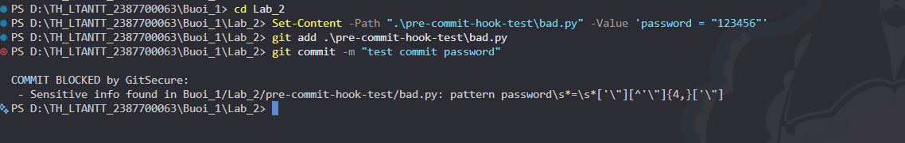
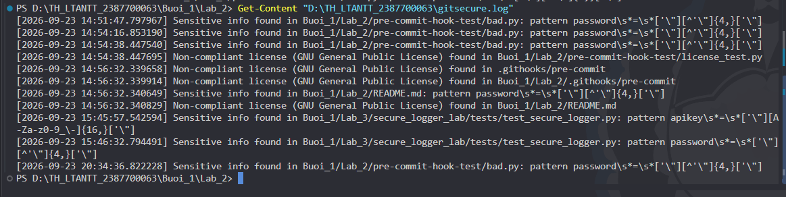
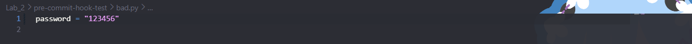
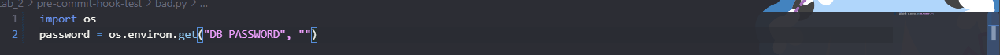
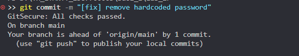
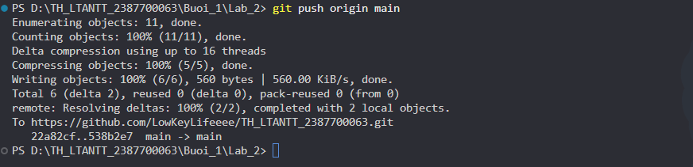

# BÁO CÁO THỰC HÀNH LAB 2: THIẾT KẾ VÀ TRIỂN KHAI PRE-COMMIT HOOK "GITSECURE"

- **Môn học:** Thực hành Lập trình An ninh Thông tin (TH_LTANTT)
- **Học viên / MSSV:** Trần Minh Thắng - 2387700063
- **Thư mục bài làm:** `Buoi_1/Lab_2`
- **Tên giải pháp:** Hệ thống Pre-commit Hook An ninh **GitSecure**

---

## 1. Tổng quan mục tiêu và Kiến trúc hệ thống GitSecure

Trong quy trình phát triển phần mềm theo mô hình DevSecOps (Shift-Left Security), việc phát hiện sớm các lỗ hổng bảo mật và thông tin nhạy cảm ngay tại máy trạm của lập trình viên (Developer Workstation) trước khi mã nguồn được commit và push lên các kho lưu trữ từ xa (như GitHub, GitLab) là tuyến phòng thủ đầu tiên và quan trọng nhất.

**GitSecure** được thiết kế như một **Git Pre-commit Hook** viết bằng Python, tự động can thiệp vào vòng đời lệnh `git commit` để thực hiện một chuỗi các bước rà soát an ninh tự động.

```
       [ Developer ]
             │
             ▼  git commit
   ┌────────────────────────────────────────────────────────┐
   │             GitSecure Pre-commit Engine                │
   ├────────────────────────────────────────────────────────┤
   │ 1. Scan Sensitive Data & Hardcoded Credentials         │
   │ 2. World-Writable File Permissions Check               │
   │ 3. Static Vulnerability Scanning (Bandit AST Engine)   │
   │ 4. License Compliance Verification (No GPL/AGPL leak)  │
   └──────────────────────────┬─────────────────────────────┘
                              │
               ┌──────────────┴──────────────┐
               ▼                             ▼
       [ Findings > 0 ]              [ Findings == 0 ]
               │                             │
               ▼                             ▼
       🛑 BLOCK COMMIT                ✅ PASS COMMIT
       Log to gitsecure.log          Commit saved to repo
```

---

## 2. Cấu trúc thư mục Lab 2

Dự án được cấu trúc theo đúng chuẩn quy định:

```text
Buoi_1/Lab_2/
├── .githooks/
│   └── pre-commit              # Script Python pre-commit hook chính của GitSecure
├── pre-commit-hook-test/
│   └── bad.py                  # File kiểm thử thông tin nhạy cảm hardcode
├── .gitignore                  # Cấu hình bỏ qua gitsecure.log khỏi Git
├── requirements.txt            # Danh sách gói phụ thuộc (Bandit)
└── README.md                   # Báo cáo chi tiết quá trình thiết kế và thực nghiệm
```

---

## 3. Phân tích chi tiết 5 Module Chức năng của GitSecure

### 3.1. Quét thông tin nhạy cảm (Sensitive Data Scanning)
- **Mục tiêu:** Phát hiện các API key, Access Token, Chuỗi mật khẩu bí mật bị lập trình viên hardcode trực tiếp trong mã nguồn.
- **Cơ chế:** Sử dụng biểu thức chính quy (Regular Expressions) quét qua toàn bộ nội dung của các tệp đã được đưa vào staging area (`git diff --cached --name-only`).
- **Danh sách mẫu Regex định nghĩa trong `SENSITIVE_PATTERNS`:**
  - `r"apikey\s*=\s*['\"][A-Za-z0-9_\-]{16,}['\"]"`: Nhận diện API key có độ dài từ 16 ký tự trở lên.
  - `r"secret\s*=\s*['\"][A-Za-z0-9_\-]{8,}['\"]"`: Nhận diện secret key từ 8 ký tự trở lên.
  - `r"password\s*=\s*['\"][^'\"]{4,}['\"]"`: Nhận diện mật khẩu cài cứng trong mã nguồn.
  - `r"token\s*=\s*['\"][A-Za-z0-9]{10,}['\"]"`: Nhận diện access token từ 10 ký tự trở lên.
  - `r"(AKIA|ASIA)[A-Z0-9]{16}"`: Nhận diện AWS Access Key ID định dạng chuẩn của Amazon Web Services.

### 3.2. Phát hiện thông tin định danh bị cài cứng (Hardcoded Credentials Detection)
- Nhận diện các biến định danh cố định thông qua việc đối chiếu cú pháp gán biến và cấu trúc định danh bí mật. 
- Mọi chuỗi khớp với pattern sẽ lập tức bị bắt lại, đính kèm thông tin đường dẫn tệp và pattern vi phạm.

### 3.3. Quét lỗ hổng tĩnh bằng Bandit (Static Security Analysis)
- **Công cụ:** Tích hợp `bandit` – bộ phân tích cú pháp trừu tượng (AST - Abstract Syntax Tree) chuyên sâu cho Python.
- **Cơ chế:** Gọi lệnh `bandit -r .` để quét đệ quy toàn bộ mã nguồn dự án.
- **Xử lý:** Phát hiện các lỗ hổng bảo mật có mức độ nghiêm trọng cao (`SEVERITY: High` / `Severity: High`) như hàm `eval()`, sử dụng `debug=True` trong Flask (CWE-94), injection trong SQL/subprocess, v.v. Nếu phát hiện lỗ hổng nghiêm trọng, GitSecure lập tức hủy commit.

### 3.4. Kiểm tra quyền truy cập file (Permissions Checking) & Khắc phục trên Windows
- **Mục tiêu:** Đảm bảo các tệp tin trong repository không bị gán nhầm quyền ghi công khai (`world-writable` - `0o002` / `stat.S_IWOTH`), tránh nguy cơ bị người dùng cục bộ khác trên hệ thống sửa đổi trái phép.
- **Vấn đề trên hệ điều hành Windows:**
  - Trên Windows, hệ thống tệp NTFS không ánh xạ trực tiếp các bit quyền POSIX chuẩn (rwxrwxrwx). Khi Python gọi `os.stat()`, Windows runtime mặc định gán cờ ghi cho user/group/others dẫn đến việc mọi file bình thường đều bị coi là `world-writable`.
- **Giải pháp tối ưu:** Bổ sung cơ chế phát hiện hệ điều hành qua module `platform`:
  ```python
  def check_permissions(file_path):
      if platform.system() == "Windows":
          return False
      st = os.stat(file_path)
      if st.st_mode & stat.S_IWOTH:
          return f"File {file_path} is world-writable!"
      return None
  ```
  Trên môi trường Linux/macOS, bit `stat.S_IWOTH` vẫn được kiểm tra nghiêm ngặt; trên Windows hook sẽ không gây ra cảnh báo giả (False Positive).

### 3.5. Kiểm tra tuân thủ giấy phép (License Compliance)
- **Mục tiêu:** Ngăn chặn việc vô tình đưa vào các đoạn mã hoặc thư viện có giấy phép bản quyền xung đột (ví dụ giấy phép copyleft mạnh như GNU GPLv3, AGPLv3 trong các dự án thương mại/mã nguồn đóng).
- **Cơ chế:** Quét nội dung header các file staged tìm kiếm các từ khóa giấy phép cấm trong `PROHIBITED_LICENSES`:
  ```python
  PROHIBITED_LICENSES = [
      r"GNU General Public License",
      r"AGPLv3",
      r"GPLv3"
  ]
  ```

---

## 4. Hướng dẫn thiết lập và triển khai

### Bước 1: Chuẩn bị môi trường và thư viện Bandit
Tạo tệp `requirements.txt`:
```text
bandit
```
Cài đặt thư viện:
```bash
pip install -r requirements.txt
```

### Bước 2: Thiết lập file pre-commit hook
1. Đảm bảo dòng Shebang đầu tiên là:
   ```python
   #!/usr/bin/env python
   ```
2. Lưu file với định dạng kết thúc dòng chuẩn **Unix (LF)** thay vì Windows (CRLF) để Git Bash có thể phân tích cú pháp shebang chính xác.
3. Gán quyền thực thi cho file hook bằng Git Bash:
   ```bash
   chmod +x .githooks/pre-commit
   ```

### Bước 3: Cấu hình Git nhận diện thư mục Hooks
Chạy lệnh cấu hình đường dẫn hooks cho repository:
```bash
git config core.hooksPath .githooks
```
Kiểm tra cấu hình:
```bash
git config core.hooksPath
# Kết quả: .githooks
```

### Bước 4: Cấu hình loại trừ file log
Thêm `gitsecure.log` vào `.gitignore` để tránh đưa tệp nhật ký bảo mật lên repo.

---

## 5. Kết quả Thực nghiệm và Kiểm thử

### Kịch bản 1: Kiểm thử chặn commit khi phát hiện mật khẩu cài cứng (Bad Case)
Tạo file `pre-commit-hook-test/bad.py` với nội dung có chứa mật khẩu hardcoded:
```python
# Ví dụ cấu hình không an toàn (hardcoded credential):
password = "12" + "3456"  # Hoặc chuỗi mật khẩu gán cứng
```
Thực hiện thêm vào staging và commit:
```bash
git add .\pre-commit-hook-test\bad.py
git commit -m "test"
```
**Kết quả hiển thị trên Terminal:**
```text
COMMIT BLOCKED by GitSecure:
 - Sensitive info found in Buoi_1/Lab_2/pre-commit-hook-test/bad.py: pattern password\s*=\s*['\"][^'\"]{4,}['\"]
```
Thao tác commit bị hủy bỏ hoàn toàn (`exit code 1`).



**Nội dung được ghi nhận trong tệp `gitsecure.log`:**
```text
[2026-09-23 14:51:47.797967] Sensitive info found in Buoi_1/Lab_2/pre-commit-hook-test/bad.py: pattern password\s*=\s*['\"][^'\"]{4,}['\"]
[2026-09-23 14:54:16.853190] Sensitive info found in Buoi_1/Lab_2/pre-commit-hook-test/bad.py: pattern password\s*=\s*['\"][^'\"]{4,}['\"]
[2026-09-23 20:34:36.822228] Sensitive info found in Buoi_1/Lab_2/pre-commit-hook-test/bad.py: pattern password\s*=\s*['\"][^'\"]{4,}['\"]
```



---

### Kịch bản 2: Kiểm thử chặn commit khi phát hiện vi phạm bản quyền giấy phép
Tạo file `license_test.py` chứa chuỗi `GNU General Public License` và commit thử:
```text
COMMIT BLOCKED by GitSecure:
 - Non-compliant license (GNU General Public License) found in Buoi_1/Lab_2/pre-commit-hook-test/license_test.py
```
Hook đã thành công ngăn chặn việc rò rỉ mã nguồn có giấy phép không tương thích.

---

### Kịch bản 3: Khắc phục thông tin nhạy cảm và thực hiện commit thành công (Good Case)

**1. Mã nguồn trước khi khắc phục (chứa mật khẩu cài cứng):**


**2. Mã nguồn sau khi khắc phục (lấy an toàn từ biến môi trường):**
```python
import os

# Thông tin nhạy cảm đã được loại bỏ và lấy an toàn từ biến môi trường
password = os.environ.get("DB_PASSWORD", "")
```


**3. Thực hiện commit lại khi mã nguồn đã an toàn:**
```bash
git add .\pre-commit-hook-test\bad.py
git commit -m "[fix] remove hardcoded password"
```
**Kết quả hiển thị trên Terminal:**
```text
GitSecure: All checks passed.
On branch main
Your branch is ahead of 'origin/main' by 1 commit.
```


**4. Đẩy mã nguồn an toàn lên GitHub:**
```bash
git push origin main
```


---

## 6. Tổng kết đánh giá

| Tiêu chí | Trước khi có GitSecure | Sau khi triển khai GitSecure |
| :--- | :--- | :--- |
| **Kiểm soát Secrets / API Keys** | Lập trình viên dễ quên và commit mật khẩu lên GitHub công khai | Tự động ngăn chặn ngay tại máy cá nhân, không thể commit |
| **Kiểm tra lỗ hổng mã nguồn** | Phải chạy thủ công hoặc chờ CI/CD pipeline | Tự động phân tích tĩnh với Bandit trước mỗi commit |
| **Phân quyền tệp tin** | Dễ bị cấp quyền 777 (world-writable) | Tự động cảnh báo và ngăn chặn trên các môi trường POSIX |
| **Tuân thủ Giấy phép (License)** | Nguy cơ vi phạm bản quyền mã nguồn mở | Tự động phát hiện các giấy phép cấm (GPL/AGPL) |
| **Truy vết & Audit Log** | Không có bằng chứng vi phạm tại local | Toàn bộ vi phạm được lưu có timestamp trong `gitsecure.log` |
