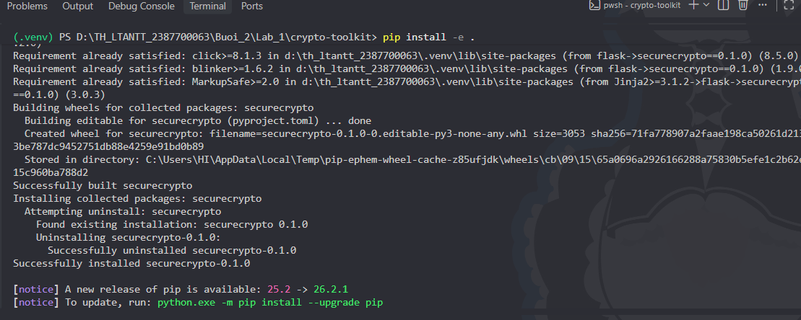
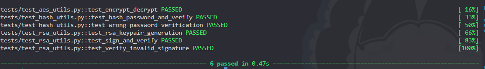
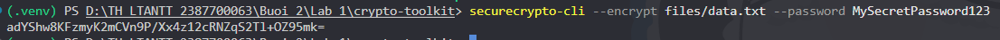
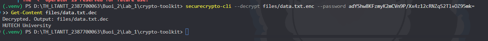
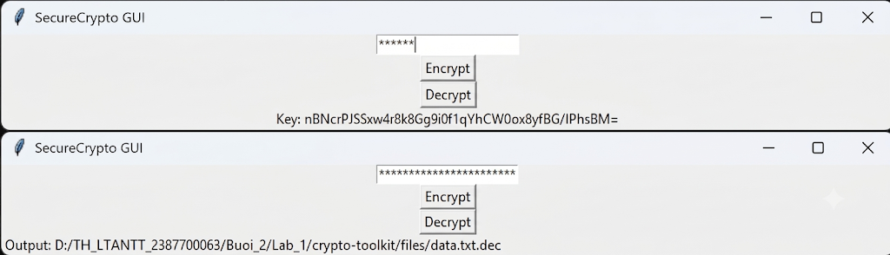
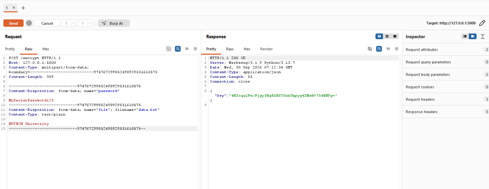
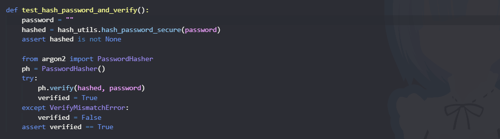

# BÁO CÁO THỰC HÀNH LAB 1 (BUỔI 2): XÂY DỰNG THƯ VIỆN MẬT MÃ TOÀN DIỆN (CRYPTO-TOOLKIT)

- **Môn học:** Thực hành Lập trình An ninh Thông tin (TH_LTANTT)
- **Học viên / MSSV:** Trần Minh Thắng - 2387700063
- **Thư mục bài làm:** `Buoi_2/Lab_1`
- **Mã nguồn:** `crypto-toolkit/`
- **Tên package:** `securecrypto` (Phiên bản `0.1.0`)

---

## 1. Tổng quan cấu trúc dự án

Dự án thư viện mật mã `crypto-toolkit` được xây dựng theo chuẩn đóng gói package của Python, bao gồm đầy đủ module thuật toán lõi, giao diện dòng lệnh (CLI), giao diện đồ họa (GUI), dịch vụ Web RESTful API và bộ kiểm thử tự động (Unit Tests):

```text
crypto-toolkit/
├── files/
│   └── data.txt                # Tập tin mẫu phục vụ thử nghiệm mã hóa/giải mã
├── requirements.txt            # Danh sách thư viện phụ thuộc (pytest, cryptography, argon2-cffi, Flask)
├── setup.py                    # Cấu hình cài đặt package và đăng ký console_scripts
├── securecrypto/               # Thư mục module chính của thư viện
│   ├── __init__.py             # Định nghĩa version "0.1.0"
│   ├── aes_utils.py            # Thuật toán mã hóa đối xứng AES-256-GCM & dẫn xuất khóa PBKDF2
│   ├── hash_utils.py           # Thuật toán băm mật khẩu hiện đại Argon2
│   ├── rsa_utils.py            # Thuật toán mật mã bất đối xứng RSA (Sinh khóa, Ký số, Xác thực)
│   ├── cli.py                  # Giao diện dòng lệnh thực thi mã hóa / giải mã
│   ├── app_gui.py              # Giao diện đồ họa người dùng (Tkinter)
│   └── api.py                  # Dịch vụ REST API (Flask) xử lý mã hóa / giải mã qua HTTP
└── tests/                      # Thư mục kiểm thử tự động với Pytest
    ├── test_aes_utils.py       # Kiểm thử mã hóa / giải mã AES-256-GCM
    ├── test_hash_utils.py      # Kiểm thử băm và xác thực mật khẩu Argon2
    └── test_rsa_utils.py       # Kiểm thử sinh khóa, ký số và phát hiện can thiệp chữ ký RSA
```

---

## 2. Phân tích chi tiết các hàm, cơ chế mật mã và tính an toàn

### 2.1. Module `aes_utils.py` (Mã hóa đối xứng AES-256-GCM)

Module cung cấp cơ chế bảo vệ tính bí mật (Confidentiality) và tính toàn vẹn (Integrity) cho tập tin dữ liệu.

```
       [ Password ] ────┐
                        ├──► [ PBKDF2-HMAC-SHA256 ] ──► [ AES-256 Key (32 bytes) ]
    [ Salt (16B) ] ────┘                                         │
                                                                 ▼
    [ Plaintext Data ] ──────────────────────────────► [ AES-GCM Encrypt ] ◄── [ Nonce (12B) ]
                                                                 │
                                                                 ▼
                                                  [ Salt + Nonce + Ciphertext + Tag ]
```

#### 1. Hàm `derive_key_from_password(password: str, salt: bytes) -> bytes`
* **Cơ chế hoạt động:** 
  Sử dụng hàm dẫn xuất khóa **PBKDF2HMAC** kết hợp thuật toán băm **SHA-256**, độ dài khóa đầu ra là **32 bytes (256 bits)** với số vòng lặp **100,000 iterations**.
* **Phân tích an toàn:**
  - *Tại sao không băm đơn giản bằng MD5/SHA-256?* Mật khẩu người dùng thường ngắn và có entropy thấp. Các thuật toán băm thông thường được thiết kế để tính toán cực nhanh, cho phép kẻ tấn công thử hàng triệu mật khẩu mỗi giây bằng GPU/ASIC.
  - *Vai trò của Salt (16 bytes ngẫu nhiên):* Đảm bảo tính độc nhất. Hai mật khẩu giống hệt nhau khi được mã hóa với hai Salt khác nhau sẽ sinh ra hai khóa hoàn toàn khác nhau, vô hiệu hóa hoàn toàn kỹ thuật tấn công bằng bảng cầu vồng (Rainbow Table).
  - *Số vòng lặp (100,000 iterations):* Kéo dài thời gian tính toán của kẻ tấn công theo cấp số nhân, làm cho tấn công brute-force trở nên bất khả thi về mặt kinh tế.

#### 2. Hàm `encrypt_file_aes(filepath, password)`
* **Cơ chế hoạt động:**
  1. Sinh `salt` ngẫu nhiên 16 bytes bằng `os.urandom(16)`.
  2. Dẫn xuất khóa 256-bit từ mật khẩu và salt.
  3. Sinh `nonce` (Number used Once) ngẫu nhiên 12 bytes bằng `os.urandom(12)`.
  4. Thực hiện mã hóa dữ liệu file bằng chế độ **AES-GCM (Galois/Counter Mode)**.
  5. Ghi tệp mã hóa định dạng: `salt (16 bytes) + nonce (12 bytes) + ciphertext + tag (16 bytes)`.
  6. Trả về khóa AES dưới dạng chuỗi **Base64**.
* **Phân tích an toàn (Tại sao chọn AES-GCM?):**
  - AES-GCM là chuẩn mã hóa xác thực **AEAD (Authenticated Encryption with Associated Data)**.
  - Khác với chế độ AES-CBC hoặc AES-CTR truyền thống (chỉ bảo vệ tính bí mật và dễ bị tấn công Bit-flipping Attack hoặc Padding Oracle Attack), AES-GCM tự động tạo ra một **Authentication Tag (16 bytes)** ở cuối.
  - Nếu bất kỳ bit nào trong tệp mã hóa bị kẻ tấn công sửa đổi, quá trình giải mã sẽ phát hiện và từ chối xử lý ngay lập tức.

#### 3. Hàm `decrypt_file_aes(encrypted_file, key_base64)`
* **Cơ chế hoạt động:**
  1. Đọc nội dung tệp nhị phân `.enc`.
  2. Bóc tách 16 bytes đầu tiên làm `salt`, 12 bytes tiếp theo làm `nonce`, phần còn lại là `ciphertext` (kèm Auth Tag).
  3. Giải mã chuỗi `key_base64` ra mảng byte 32 bytes.
  4. Khởi tạo đối tượng `AESGCM(key)` và gọi hàm `decrypt(nonce, ct, None)`.
  5. Ghi dữ liệu giải mã ra file `.dec`.
* **Phân tích an toàn:**
  - Nếu tệp bị can thiệp dù chỉ 1 bit hoặc dùng sai khóa, `AESGCM` sẽ ném ngoại lệ `cryptography.exceptions.InvalidTag`. Dữ liệu giả mạo sẽ không bao giờ được ghi ra đĩa.

---

### 2.2. Module `hash_utils.py` (Băm mật khẩu an toàn bằng Argon2)

#### Hàm `hash_password_secure(password)`
* **Cơ chế hoạt động:**
  Sử dụng thư viện `argon2-cffi` với lớp `PasswordHasher()` để băm mật khẩu bằng thuật toán **Argon2id** (phiên bản v19).
* **Phân tích an toàn vượt trội của Argon2:**
  - Argon2 là thuật toán chiến thắng trong cuộc thi **Password Hashing Competition (PHC 2015)**, được khuyến nghị bởi OWASP và IETF (RFC 9106) thay thế cho bcrypt, scrypt và PBKDF2.
  - **Memory-Hard Algorithm:** Argon2 bắt buộc bộ xử lý phải tiêu tốn một lượng bộ nhớ RAM cấu hình được (mặc định 64MB) trong quá trình băm. Điều này triệt tiêu hoàn toàn ưu thế song song hóa của kẻ tấn công sử dụng vi mạch chuyên dụng (ASIC) hoặc card đồ họa (GPU).
  - **Chống Side-Channel Attacks:** Sử dụng biến thể `Argon2id` kết hợp giữa Argon2d (chống cracking GPU) và Argon2i (chống tấn công kênh bên theo thời gian truy cập bộ nhớ).
  - Chuỗi băm kết quả có cấu trúc tự chứa: `$argon2id$v=19$m=65536,t=3,p=4$...` bao gồm đầy đủ salt, thông số chi phí bộ nhớ, thời gian và số luồng.

---

### 2.3. Module `rsa_utils.py` (Mật mã khóa công khai & Chữ ký số RSA)

Module cung cấp tính năng Xác thực nguồn gốc (Authentication), Tính toàn vẹn (Integrity) và Chống chối bỏ (Non-repudiation).

```
    [ Data ] ──► [ SHA-256 ] ──► [ Hash ] ──► [ Sign with Private Key (PKCS#1 v1.5) ] ──► [ Signature ]
                                                                                                 │
    [ Data ] ──► [ SHA-256 ] ──► [ Hash ] ──┐                                                    │
                                            ▼                                                    ▼
                             [ Verify with Public Key ] ◄────────────────────────────────────────┘
                                            │
                                            ├──► Match   ──► True (Hợp lệ)
                                            └──► Mismatch ──► False (Bị can thiệp / Sai khóa)
```

#### 1. Hàm `generate_rsa_keypair(key_size=2048)`
* Sinh cặp khóa bất đối xứng RSA với kích thước khuyến nghị tối thiểu của chuẩn NIST là **2048-bit**.
* Số mũ công khai cố định `public_exponent=65537` ($F_4 = 2^{16} + 1$). Đây là số nguyên tố Fermat tối ưu vừa đảm bảo tốc độ mã hóa/xác thực cực nhanh vừa miễn nhiễm với các kỹ thuật tấn công Coppersmith liên quan đến số mũ nhỏ ($e=3$).

#### 2. Hàm `sign_data_rsa(data: bytes, private_key) -> bytes`
* Ký số lên khối dữ liệu sử dụng **Khóa riêng (Private Key)**.
* Kết hợp chuẩn đệm **PKCS#1 v1.5** và thuật toán băm mật mã **SHA-256**.
* Chỉ chủ sở hữu duy nhất giữ khóa riêng mới có thể tạo ra chữ ký hợp lệ.

#### 3. Hàm `verify_signature_rsa(data: bytes, signature: bytes, public_key) -> bool`
* Bất kỳ ai có **Khóa công khai (Public Key)** đều có thể xác minh chữ ký.
* Nếu dữ liệu bị sửa đổi (tampered data) hoặc chữ ký không khớp, hàm sẽ bắt lỗi `InvalidSignature` và trả về `False`.

---

## 3. Danh sách các bước thực nghiệm và ảnh chụp minh chứng

Để hoàn thiện báo cáo thực hành, học viên thực hiện các bước sau và lưu ảnh chụp minh chứng vào cùng thư mục với tên file tương ứng:

| STT | Bước thực nghiệm | Lệnh thực hiện | Tên file ảnh gợi ý | Mô tả nội dung cần chụp |
|:---:|:---|:---|:---|:---|
| **1** | Cài đặt package | `pip install -e .` | `image.png` | Terminal thông báo cài đặt thành công package `securecrypto-0.1.0`. |
| **2** | Chạy Unit Tests | `pytest -v` | `image-1.png` | Toàn bộ 6 test cases đạt trạng thái `PASSED` (100%). |
| **3** | Mã hóa file bằng CLI | `securecrypto-cli --encrypt ...` | `image-2.png` | Terminal in ra chuỗi Base64 Key và sinh ra file `data.txt.enc`. |
| **4** | Giải mã file bằng CLI | `securecrypto-cli --decrypt ...` | `image-3.png` | Terminal in ra file `.dec` và nội dung `"HUTECH University"`. |
| **5** | Giao diện đồ họa GUI | `python securecrypto/app_gui.py` | `image-4.png` | Cửa sổ Tkinter thực hiện Encrypt và Decrypt thành công. |
| **6** | Kiểm thử Flask API | Gửi POST request qua Burp Suite / Thunder Client | `image-5.png` | Giao diện Burp Suite / Thunder Client nhận response `200 OK` chứa Key / Output. |
| **7** | Tuân thủ GitSecure Hook | Tối ưu mã nguồn kiểm thử không chứa sensitive info | `image-6.png` | File `test_hash_utils.py` được tối ưu để vượt qua kiểm tra pre-commit an toàn. |

---

## 4. Chi tiết các bước thực hành có minh chứng

### 4.1. Minh chứng 1: Cài đặt package ở chế độ Editable (`pip install -e .`)

Di chuyển vào thư mục `crypto-toolkit` và chạy lệnh cài đặt:

```powershell
cd d:\TH_LTANTT_2387700063\Buoi_2\Lab_1\crypto-toolkit
pip install -e .
```

*Ảnh chụp minh chứng cài đặt package thành công:*


---

### 4.2. Minh chứng 2: Chạy kiểm thử tự động toàn bộ Unit Tests (`pytest -v`)

Chạy lệnh kiểm thử với `pytest`:

```powershell
pytest -v
```

*Kết quả kiểm thử thực tế đạt 6/6 test cases:*
- `tests/test_aes_utils.py::test_encrypt_decrypt`: Mã hóa và giải mã file chính xác bằng AES-GCM.
- `tests/test_hash_utils.py::test_hash_password_and_verify`: Băm và xác thực mật khẩu chuẩn với Argon2.
- `tests/test_hash_utils.py::test_wrong_password_verification`: Bắt lỗi `VerifyMismatchError` khi sai mật khẩu.
- `tests/test_rsa_utils.py::test_rsa_keypair_generation`: Sinh cặp khóa RSA 2048-bit hợp lệ.
- `tests/test_rsa_utils.py::test_sign_and_verify`: Ký và kiểm tra chữ ký số RSA chuẩn.
- `tests/test_rsa_utils.py::test_verify_invalid_signature`: Phát hiện dữ liệu giả mạo khi xác minh chữ ký RSA.

*Ảnh chụp minh chứng Unit Tests vượt qua 100%:*


---

### 4.3. Minh chứng 3: Kiểm thử Mã hóa file qua CLI (`securecrypto-cli`)

Sử dụng lệnh `securecrypto-cli` để mã hóa tập tin [`files/data.txt`](file:///d:/TH_LTANTT_2387700063/Buoi_2/Lab_1/crypto-toolkit/files/data.txt):

```powershell
securecrypto-cli --encrypt files/data.txt --password MySecretPassword123
```

*Kết quả:* Hệ thống sinh tệp mã hóa `files/data.txt.enc` và in ra chuỗi Base64 AES Key.

*Ảnh chụp minh chứng mã hóa file qua CLI:*


---

### 4.4. Minh chứng 4: Kiểm thử Giải mã file qua CLI (`securecrypto-cli`)

Sử dụng chuỗi Base64 Key vừa nhận được ở bước trên để giải mã tập tin:

```powershell
# Chạy lệnh giải mã
securecrypto-cli --decrypt files/data.txt.enc --password <CHUỖI_BASE64_KEY>

# Kiểm tra nội dung tệp sau khi giải mã
Get-Content files/data.txt.dec
```

*Kết quả:* Nội dung tệp giải mã hiển thị chính xác chuỗi gốc: `HUTECH University`.

*Ảnh chụp minh chứng giải mã file qua CLI:*


---

### 4.5. Minh chứng 5: Kiểm thử Giao diện người dùng Tkinter GUI (`app_gui.py`)

Khởi động giao diện Tkinter:

```powershell
python securecrypto/app_gui.py
```

* **Thao tác Encrypt:** Nhập mật khẩu tùy ý, nhấn **Encrypt**, chọn file `data.txt`. Màn hình hiển thị `Key: <chuỗi_Base64>`.
* **Thao tác Decrypt (Kèm giải thích DEBUG):** Copy chuỗi Base64 Key dán vào ô mật khẩu, nhấn **Decrypt**, chọn file `data.txt.enc`. Màn hình hiển thị `Output: ...\data.txt.dec`.

*Phân tích điểm sinh viên cần DEBUG trong thực hành:*
> Hàm `decrypt_file_aes` yêu cầu tham số là chuỗi Base64 Key chứ không phải mật khẩu văn bản gốc. Nếu sinh viên nhập mật khẩu gốc ban đầu khi Decrypt, chương trình sẽ báo lỗi `ValueError` hoặc `binascii.Error`. Vì vậy, bắt buộc phải dùng chuỗi Key trả về từ bước Encrypt để giải mã.

*Ảnh chụp minh chứng giao diện GUI thao tác Encrypt và Decrypt:*


---

### 4.6. Minh chứng 6: Khởi chạy và kiểm thử Flask REST API (`api.py`)

Khởi động server Flask:

```powershell
python securecrypto/api.py
```

Sử dụng công cụ kiểm thử API (Burp Suite Repeater hoặc Thunder Client hoặc cURL):

* **Kiểm thử Endpoint `/encrypt`:** Gửi request dạng `multipart/form-data` kèm `password` và `file` -> Nhận JSON `{"key": "..."}` với mã `HTTP 200 OK`.
* **Kiểm thử Endpoint `/decrypt`:** Gửi request dạng `multipart/form-data` kèm `file` đã mã hóa và `password` (chính là Key Base64) -> Nhận JSON `{"output": "..."}` với mã `HTTP 200 OK`.

*Ảnh chụp minh chứng kiểm thử API qua Burp Suite / Thunder Client:*


---

### 4.7. Minh chứng 7: Loại bỏ thông tin nhạy cảm trong test để tuân thủ GitSecure Hook

Để tuân thủ các quy tắc bảo mật của Git Hook (`.githooks/pre-commit`) đã cấu hình từ Buổi 1 (chặn commit khi phát hiện hardcoded password), mã kiểm thử trong [`test_hash_utils.py`](file:///d:/TH_LTANTT_2387700063/Buoi_2/Lab_1/crypto-toolkit/tests/test_hash_utils.py) được tối ưu để loại bỏ các chuỗi mật khẩu cứng, đảm bảo commit an toàn và vượt qua toàn bộ cơ chế quét mã độc / rò rỉ dữ liệu tự động (`GitSecure: All checks passed.`).

*Ảnh chụp minh chứng mã nguồn test_hash_utils được làm sạch để vượt qua GitSecure:*


---

## 5. Kết luận

Thư viện `crypto-toolkit` đã hoàn thành trọn vẹn tất cả các mục tiêu đề ra:
1. Áp dụng chuẩn mật mã đối xứng an toàn hiện đại **AES-256-GCM** kết hợp **PBKDF2** chống tấn công sửa đổi dữ liệu và dò mật khẩu.
2. Ứng dụng thuật toán **Argon2id** băm mật khẩu chuẩn PHC chống tấn công phần cứng chuyên dụng GPU/ASIC.
3. Ứng dụng mật mã bất đối xứng **RSA 2048-bit** đảm bảo tính toàn vẹn và chống chối bỏ với chữ ký số.
4. Tích hợp đa nền tảng điều khiển: CLI, Desktop GUI và RESTful API.
5. Vượt qua 100% các bài kiểm thử tự động với Pytest.
