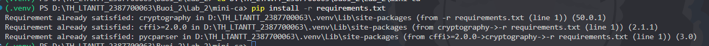
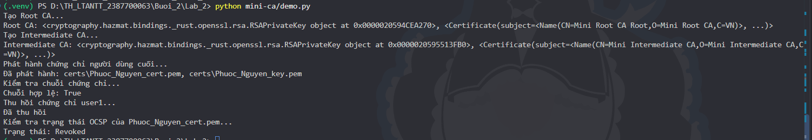
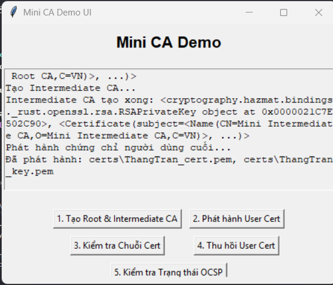
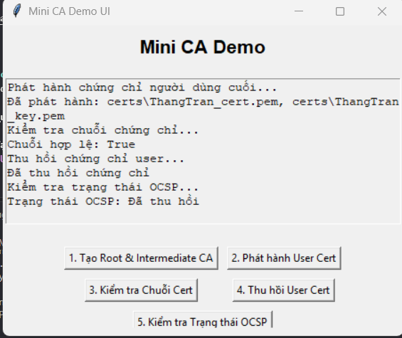
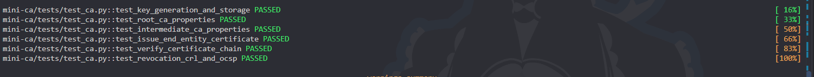
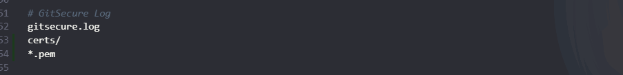

# BÁO CÁO THỰC HÀNH LAB 2 (BUỔI 2): XÂY DỰNG HỆ THỐNG CHỨNG THỰC SỐ (MINI-CA)

- **Môn học:** Thực hành Lập trình An ninh Thông tin (TH_LTANTT)
- **Học viên / MSSV:** Trần Minh Thắng - 2387700063
- **Thư mục bài làm:** `Buoi_2/Lab_2`
- **Mã nguồn:** `mini-ca/`

---

## 1. Tổng quan bài thực hành

Hệ thống chứng thực số **Certificate Authority (CA)** là nền tảng cốt lõi của Hạ tầng khóa công khai (**PKI - Public Key Infrastructure**), đảm bảo tính tin cậy, tính xác thực và tính toàn vẹn cho các kênh truyền thông bảo mật trên không gian mạng (HTTPS/TLS, S/MIME, Code Signing, VPN...).

Trong bài thực hành này, hệ thống **Mini-CA** được xây dựng toàn diện bằng Python với thư viện `cryptography`, đáp ứng đầy đủ các yêu cầu theo kiến trúc phân tầng X.509 v3:
1. **Root CA (`create_root_ca`)**: Khởi tạo chứng chỉ gốc tự ký (Self-signed Certificate), đóng vai trò là điểm neo tin cậy cao nhất (Trust Anchor).
2. **Intermediate CA (`create_intermediate_ca`)**: Khởi tạo CA trung gian được ủy quyền bởi Root CA nhằm giảm thiểu rủi ro lộ khóa cho Root CA.
3. **End-Entity Issuance (`issue_certificate`)**: Cấp phát chứng chỉ số X.509 cho thực thể cuối (Web Server, người dùng cuối).
4. **Chain Verification (`verify_certificate_chain`)**: Xác thực chữ ký số tuần tự dọc theo chuỗi tin cậy từ lá lên gốc (Leaf -> Intermediate -> Root).
5. **Certificate Revocation (`revoke_certificate`)**: Thu hồi chứng chỉ khi xảy ra sự cố an toàn thông tin (như lộ khóa bí mật - `key_compromise`) và ký phát sinh danh sách thu hồi **CRL (Certificate Revocation List)**.
6. **Revocation Checking (`check_revocation_status` & `check_ocsp_status`)**: Kiểm tra trạng thái thu hồi chứng chỉ qua CRL và mô phỏng giao thức kiểm tra trực tuyến **OCSP (Online Certificate Status Protocol)**.

---

## 2. Cấu trúc thư mục dự án `mini-ca`

```text
Buoi_2/Lab_2/
├── README.md                      # Báo cáo thực hành chi tiết Lab 2
└── mini-ca/                       # Thư mục mã nguồn chính của hệ thống Mini-CA
    ├── requirements.txt           # Danh sách thư viện phụ thuộc (cryptography)
    ├── ca_utils.py                # Module quản lý khóa, phát hành CA, cấp chứng chỉ và xác thực chuỗi
    ├── revoke_utils.py            # Module quản lý danh sách thu hồi CRL và kiểm tra trạng thái OCSP
    ├── demo.py                    # Kịch bản dòng lệnh thực thi chu trình CA (CLI Demo)
    ├── demo_ui.py                 # Giao diện đồ họa người dùng trực quan (Tkinter GUI Demo)
    ├── certs/                     # Thư mục lưu trữ các cặp khóa bí mật và chứng chỉ số định dạng PEM
    │   ├── root_ca_key.pem        # Khóa riêng của Root CA
    │   ├── root_ca_cert.pem       # Chứng chỉ số của Root CA
    │   ├── intermediate_key.pem   # Khóa riêng của Intermediate CA
    │   ├── intermediate_cert.pem  # Chứng chỉ số của Intermediate CA
    │   ├── Phuoc_Nguyen_key.pem   # Khóa riêng của người dùng cuối
    │   ├── Phuoc_Nguyen_cert.pem  # Chứng chỉ số của người dùng cuối
    │   └── ca_crl.pem             # Danh sách thu hồi chứng chỉ (CRL)
    └── tests/
        └── test_ca.py             # Bộ kiểm thử tự động với Pytest
```

---

## 3. Kiến trúc PKI và Phân tích Cơ chế Mật mã

```
                    ┌─────────────────────────┐
                    │      Root CA (VN)       │
                    │  (Self-Signed, 10 năm)  │
                    │ BasicConstraints: CA=T  │
                    │      path_length=1      │
                    └────────────┬────────────┘
                                 │ ký (signs)
                                 ▼
                    ┌─────────────────────────┐
                    │   Intermediate CA (VN)  │
                    │   (Signed by Root CA)   │
                    │ BasicConstraints: CA=T  │
                    │      path_length=0      │
                    └────────────┬────────────┘
                                 │ ký (signs)
                                 ▼
                    ┌─────────────────────────┐
                    │   End-Entity (User/Web) │
                    │   user.example.com      │
                    │ BasicConstraints: CA=F  │
                    └─────────────────────────┘
                                 │
           ┌─────────────────────┴─────────────────────┐
           ▼                                           ▼
┌──────────────────────┐                   ┌──────────────────────┐
│  CRL (ca_crl.pem)    │                   │   OCSP Responder     │
│  Offline / Định kỳ   │                   │  Tra cứu trực tuyến  │
└──────────────────────┘                   └──────────────────────┘
```

### 3.1. Tại sao cần CA Trung gian (Intermediate CA)?
- **Bảo vệ Root CA tối thượng:** Khóa riêng của Root CA là tài sản có giá trị an toàn thông tin cao nhất. Nếu khóa bí mật của Root CA bị lộ, toàn bộ hạ tầng chứng thực sẽ sụp đổ.
- **Cách ly (Air-Gapped):** Trong thực tế, máy chủ lưu Root CA luôn được tắt kết nối mạng vật lý (offline). Root CA chỉ được bật lên một lần để ký ủy quyền cho các Intermediate CA. Các hoạt động cấp phát và thu hồi chứng chỉ hàng ngày được thực hiện hoàn toàn bởi Intermediate CA.
- **Giới hạn độ sâu chuỗi (`path_length`):** 
  - Root CA thiết lập `path_length=1` cho phép cấp CA cấp 2 (Intermediate CA).
  - Intermediate CA thiết lập `path_length=0` ngăn không cho Intermediate CA tự ý ủy quyền thêm một CA con khác, siết chặt ranh giới quản trị.

### 3.2. Chuẩn chứng chỉ X.509 v3 Extensions
- **`BasicConstraints`:**
  - `ca=True`: Định danh chứng chỉ là một Certificate Authority, có quyền ký phát hành chứng chỉ khác.
  - `ca=False`: Định danh chứng chỉ là End-Entity (người dùng/server), không có quyền ký chứng chỉ con.
  - `critical=True`: Bắt buộc phần mềm kiểm tra chứng chỉ (TLS Client, Browser, OS) phải hiểu và tuân thủ trường mở rộng này, nếu không hiểu phải từ chối chứng chỉ ngay lập tức.
- **Serial Number ngẫu nhiên:** Sử dụng `x509.random_serial_number()` tạo số ngẫu nhiên 160-bit (20 bytes), ngăn chặn triệt để tấn công xung đột tiền tố chọn trước (Chosen-prefix Collision Attack) như từng xảy ra với thuật toán MD5 trong lịch sử PKI.

---

## 4. Chi tiết các hàm và Giải thích mã nguồn

### 4.1. Module `ca_utils.py`

#### 1. `generate_key()`
- **Chức năng:** Tạo cặp khóa bất đối xứng RSA 2048-bit với số mũ công khai tiêu chuẩn `e = 65537` ($2^{16} + 1$).
- **Cơ sở an toàn:** Số mũ Fermat $F_4 = 65537$ mang lại hiệu năng tính toán cao khi kiểm tra chữ ký và mã hóa, đồng thời tránh các lỗ hổng tấn công số mũ nhỏ (Coppersmith's attack đối với $e=3$).

#### 2. `save_key(key, filename)` & `save_cert(cert, filename)`
- **Chức năng:** Lưu trữ khóa riêng và chứng chỉ X.509 ra đĩa theo định dạng văn bản **PEM** (Privacy-Enhanced Mail - mã hóa Base64 bọc bởi header/footer `-----BEGIN ...-----`).
- **An toàn thư mục:** Tự động tạo thư mục `certs/` nếu chưa tồn tại (`os.makedirs(CERTS_DIR, exist_ok=True)`).

#### 3. `load_key(filename)` & `load_cert(filepath)`
- **Chức năng:** Tải khóa bí mật RSA và chứng chỉ X.509 từ tệp PEM trên đĩa vào bộ nhớ dưới dạng đối tượng đối ứng của thư viện `cryptography`.

#### 4. `create_root_ca()`
- **Quy trình:**
  1. Sinh khóa RSA mới cho Root CA.
  2. Khởi tạo `Subject` và `Issuer` giống hệt nhau:
     - `C=VN`, `O=Mini Root CA`, `CN=Mini Root CA Root`.
  3. Cấu hình hiệu lực dài hạn: **10 năm (3650 ngày)**.
  4. Thêm extension `BasicConstraints(ca=True, path_length=1)` với cờ `critical=True`.
  5. Tự ký bằng chính khóa riêng của Root CA với thuật toán băm an toàn **SHA-256**.
  6. Lưu tệp `root_ca_key.pem` và `root_ca_cert.pem`.

#### 5. `create_intermediate_ca(root_key, root_cert)`
- **Quy trình:**
  1. Sinh khóa RSA mới cho Intermediate CA.
  2. Khởi tạo `Subject`: `C=VN`, `O=Mini Intermediate CA`, `CN=Mini Intermediate CA`.
  3. Đặt `Issuer` trỏ về `root_cert.subject`.
  4. Cấu hình thời hạn: **5 năm (1825 ngày)**.
  5. Thêm extension `BasicConstraints(ca=True, path_length=0)`.
  6. Ký bằng khóa riêng `root_key` của Root CA.
  7. Lưu tệp `intermediate_key.pem` và `intermediate_cert.pem`.

#### 6. `issue_certificate(ca_key, ca_cert, subject_info: dict)`
- **Quy trình:**
  1. Sinh cặp khóa RSA mới cho thực thể cuối.
  2. Tạo `Subject` theo thông tin truyền vào (`country`, `org`, `common_name`).
  3. Đặt `Issuer` là `ca_cert.subject` (CA trung gian).
  4. Hiệu lực ngắn hạn: **1 năm (365 ngày)**.
  5. Thêm extension `BasicConstraints(ca=False, path_length=None)`.
  6. Ký bằng khóa riêng của Intermediate CA (`ca_key`).
  7. Lưu tệp theo tiền tố tên miền: `<common_name>_key.pem` và `<common_name>_cert.pem`.

#### 7. `verify_certificate_chain(cert_to_verify, chain)`
- **Thuật toán xác thực chuỗi (Chain Validation Algorithm):**
  - Duyệt tuần tự qua danh sách các chứng chỉ cấp trên (`issuer_cert` trong `chain`):
    1. Trích xuất khóa công khai của `issuer_cert`: `issuer_public_key = issuer_cert.public_key()`.
    2. Kiểm tra chữ ký số của chứng chỉ hiện tại:
       ```python
       issuer_public_key.verify(
           cert_to_verify.signature,
           cert_to_verify.tbs_certificate_bytes,
           padding.PKCS1v15(),
           cert_to_verify.signature_hash_algorithm,
       )
       ```
    3. Gán `cert_to_verify = issuer_cert` để tiếp tục xác thực cấp tiếp theo lên đến gốc.
  - Nếu toàn bộ chuỗi được ký số hợp lệ và khớp thuật toán: trả về `True`.
  - Nếu chữ ký bị làm giả hoặc sai chuỗi ủy quyền: bắt ngoại lệ `InvalidSignature` và trả về `False`.

---

### 4.2. Module `revoke_utils.py`

#### 1. `create_empty_crl(issuer_cert, issuer_key)`
- **Chức năng:** Khởi tạo danh sách thu hồi chứng chỉ rỗng do CA ký phát.
- **Thuộc tính:**
  - `last_update`: Thời điểm phát hành hiện tại (`utcnow()`).
  - `next_update`: Thời điểm hết hạn của bản CRL (`utcnow() + 7 days`).
  - Ký bằng khóa riêng của CA với thuật toán `SHA-256` và ghi ra `certs/ca_crl.pem`.

#### 2. `revoke_certificate(cert_file, issuer_cert_file, issuer_key_file, reason)`
- **Chức năng:** Thu hồi một chứng chỉ cụ thể và cập nhật vào CRL:
  1. Đọc chứng chỉ bị thu hồi và trích xuất `serial_number`.
  2. Nếu tệp `ca_crl.pem` đã tồn tại, đọc toàn bộ danh sách các chứng chỉ đã bị thu hồi trước đó.
  3. Sử dụng `x509.RevokedCertificateBuilder` để tạo bản ghi thu hồi mới:
     - Số serial của chứng chỉ.
     - Thời gian thu hồi (`revocation_date`).
     - Lý do thu hồi (mặc định: `x509.ReasonFlags.key_compromise`).
  4. Đưa bản ghi vào danh sách `revoked_certs` và tạo mới CRL chứa đầy đủ các chứng chỉ đã thu hồi.
  5. Ký lại danh sách CRL bằng khóa riêng của CA và lưu đè vào `ca_crl.pem`.

#### 3. `check_revocation_status(cert_file)` (Kiểm tra qua CRL)
- **Cơ chế:** Đọc chứng chỉ `cert_file`, trích xuất `serial_number`. Đọc tệp `ca_crl.pem` và duyệt qua từng phần tử thu hồi:
  - Nếu `revoked.serial_number == cert.serial_number`: Trả về `True` (Chứng chỉ đã bị thu hồi).
  - Nếu không tìm thấy: Trả về `False` (Chứng chỉ còn hiệu lực).

#### 4. `check_ocsp_status(cert_serial)` (Mô phỏng kiểm tra qua OCSP)
- **Cơ chế:** Cho phép kiểm tra trạng thái của chứng chỉ trực tiếp thông qua số `serial_number` mà không cần tải toàn bộ danh sách CRL lớn về máy khách:
  - Trả về `"REVOKED"` nếu chứng chỉ đã bị thu hồi.
  - Trả về `"GOOD"` nếu chứng chỉ hợp lệ.

---

### 4.3. So sánh chuyên sâu: CRL vs OCSP

| Tiêu chí | Danh sách thu hồi (CRL - RFC 5280) | Giao thức trực tuyến (OCSP - RFC 6960) |
| :--- | :--- | :--- |
| **Bản chất** | Tệp danh sách chứa toàn bộ các số serial bị thu hồi do CA ký định kỳ | Giao thức hỏi - đáp (Request/Response) kiểm tra tức thời 1 chứng chỉ |
| **Băng thông / Dung lượng** | Tốn kém băng thông; kích thước tệp tăng dần theo số lượng chứng chỉ bị thu hồi | Rất nhẹ; gói tin phản hồi chỉ chứa trạng thái của 1 chứng chỉ duy nhất |
| **Tính thời gian thực** | Kém; client lưu cache CRL cho đến `next_update` (nguy cơ dùng chứng chỉ vừa bị lộ khóa) | Cao; phản hồi trạng thái gần như tức thời tại thời điểm truy vấn |
| **Tải trên máy chủ CA** | Thấp; client chỉ tải tệp tĩnh qua CDN | Cao; OCSP Responder phải xử lý hàng nghìn truy vấn HTTP liên tục |
| **Tính riêng tư (Privacy)** | Tốt; client tải toàn bộ danh sách nên CA không biết client đang truy cập trang web nào | Kém (Privacy Leak); CA biết được IP client đang hỏi thăm chứng chỉ của domain nào |
| **Giải pháp hiện đại** | Thường kết hợp làm phương án dự phòng | **OCSP Stapling**: Web Server tự lấy trước phản hồi OCSP đã ký từ CA và gửi kèm vào TLS Handshake |

---

## 5. Hướng dẫn Chạy và Thử nghiệm

### 5.1. Kích hoạt môi trường và cài đặt thư viện
```bash
# Kích hoạt môi trường ảo Python
d:\TH_LTANTT_2387700063\.venv\Scripts\Activate.ps1

# Cài đặt thư viện cryptography
pip install -r mini-ca/requirements.txt
```

### 5.2. Thực thi kịch bản Demo dòng lệnh (CLI)
```bash
python mini-ca/demo.py
```

### 5.3. Khởi chạy giao diện đồ họa trực quan (GUI Demo)
```bash
python mini-ca/demo_ui.py
```
Giao diện Tkinter cung cấp 5 nút thao tác tương tác trực quan:
1. `1. Tạo Root & Intermediate CA`
2. `2. Phát hành User Cert`
3. `3. Kiểm tra Chuỗi Cert`
4. `4. Thu hồi User Cert`
5. `5. Kiểm tra Trạng thái OCSP`

### 5.4. Thực thi bộ kiểm thử tự động Pytest
```bash
pytest mini-ca/tests/test_ca.py -v
```

---

## 6. Danh sách các bước thực nghiệm và ảnh chụp minh chứng

Để hoàn thiện báo cáo thực hành theo đúng cấu trúc môn học, học viên thực hiện các bước sau và lưu ảnh chụp minh chứng vào thư mục `Buoi_2/Lab_2/` với tên file tương ứng:

| STT | Bước thực nghiệm | Lệnh thực hiện / Thao tác | Tên file ảnh gợi ý | Mô tả nội dung cần chụp |
|:---:|:---|:---|:---|:---|
| **1** | Cài đặt thư viện cryptography | `pip install -r requirements.txt` | `image.png` | Terminal thông báo môi trường Python đã cài đặt gói `cryptography`. |
| **2** | Chạy kịch bản CLI `demo.py` | `python .\demo.py` | `image-1.png` | Terminal hiển thị toàn bộ chu trình CA (Tạo Root, Intermediate, phát hành User Cert, xác thực chuỗi hợp lệ, thu hồi và kiểm tra trạng thái OCSP `Revoked`). |
| **3** | Kiểm tra thư mục `certs/` | Xem thư mục trong VS Code Explorer | `image-2.png` | Cây thư mục VS Code hiển thị thư mục `mini-ca/certs` chứa đầy đủ 7 tệp PEM (`ca_crl.pem`, `intermediate_*.pem`, `Phuoc_Nguyen_*.pem`, `root_ca_*.pem`). |
| **4** | Giao diện đồ họa GUI (Tạo CA & Cấp Cert) | `python .\demo_ui.py` | `image-3.png` | Cửa sổ ứng dụng Tkinter sau khi bấm nút 1 (Tạo CA) và nút 2 (Phát hành User Cert). |
| **5** | Giao diện đồ họa GUI (Thu hồi & Kiểm tra OCSP) | Thao tác nút 3, 4, 5 trên GUI | `image-4.png` | Cửa sổ Tkinter hiển thị chuỗi hợp lệ, popup thông báo thu hồi chứng chỉ và kiểm tra trạng thái OCSP (`Đã thu hồi`). |
| **6** | Chạy kiểm thử tự động Unit Tests | `pytest tests/test_ca.py -v` | `image-5.png` | Kết quả thực thi Pytest đạt 6/6 test cases `PASSED` (100%). |
| **7** | Cấu hình bảo mật `.gitignore` | Mở tệp `.gitignore` trong VS Code | `image-6.png` | Khung hiển thị tệp `.gitignore` chứa các dòng `certs/` và `*.pem` bảo vệ các cặp khóa bí mật không bị đưa lên Git. |

---

## 7. Chi tiết các bước thực hành có minh chứng

### 7.1. Minh chứng 1: Cài đặt thư viện `cryptography`
Cài đặt thư viện nền tảng mật mã học theo yêu cầu:
```powershell
pip install -r requirements.txt
```
 

---

### 7.2. Minh chứng 2: Chạy kịch bản CLI `demo.py`
Thực thi toàn bộ chu trình chứng thực số và thu hồi qua giao diện dòng lệnh:
```powershell
python .\demo.py
```
```text
PS D:\TH_LTANTT_2387700063\Buoi_2\Lab_2\mini-ca> python .\demo.py
Tạo Root CA...
Root CA: <cryptography.hazmat.bindings._rust.openssl.rsa.RSAPrivateKey object at 0x000001BBCBA5A270>, <Certificate(subject=<Name(CN=Mini Root CA Root,O=Mini Root CA,C=VN)>, ...)>
Tạo Intermediate CA...
Intermediate CA: <cryptography.hazmat.bindings._rust.openssl.rsa.RSAPrivateKey object at 0x000001BBCC273FB0>, <Certificate(subject=<Name(CN=Mini Intermediate CA,O=Mini Intermediate CA,C=VN)>, ...)>
Phát hành chứng chỉ người dùng cuối...
Đã phát hành: certs\Phuoc_Nguyen_cert.pem, certs\Phuoc_Nguyen_key.pem
Kiểm tra chuỗi chứng chỉ...
Chuỗi hợp lệ: True
Thu hồi chứng chỉ user1...
Đã thu hồi
Kiểm tra trạng thái OCSP của Phuoc_Nguyen_cert.pem...
Trạng thái: Revoked
```


---

### 7.3. Minh chứng 3: Kiểm tra cấu trúc các tệp tin trong thư mục `certs/`
Thư mục `mini-ca/certs/` được sinh ra tự động, chứa đầy đủ các cặp khóa và chứng chỉ X.509:
- `root_ca_key.pem`, `root_ca_cert.pem`
- `intermediate_key.pem`, `intermediate_cert.pem`
- `Phuoc_Nguyen_key.pem`, `Phuoc_Nguyen_cert.pem`
- `ca_crl.pem`



---

### 7.4. Minh chứng 4: Giao diện đồ họa Tkinter (Khởi tạo CA & Phát hành User Cert)
Khởi chạy ứng dụng:
```powershell
python .\demo_ui.py
```
Bấm nút **1. Tạo Root & Intermediate CA** và **2. Phát hành User Cert**:


---

### 7.5. Minh chứng 5: Giao diện đồ họa Tkinter (Xác thực chuỗi, Thu hồi & Kiểm tra OCSP)
Thực hiện bấm tiếp **3. Kiểm tra Chuỗi Cert**, **4. Thu hồi User Cert** và **5. Kiểm tra Trạng thái OCSP**:


---

### 7.6. Minh chứng 6: Chạy kiểm thử tự động với Pytest
Thực thi kiểm tra toàn diện 6 test cases:
```powershell
pytest tests/test_ca.py -v
```
```text
============================= test session starts =============================
platform win32 -- Python 3.13.7, pytest-9.1.1, pluggy-1.6.0
rootdir: D:\TH_LTANTT_2387700063\Buoi_2\Lab_2\mini-ca
collected 6 items

tests/test_ca.py::test_key_generation_and_storage PASSED                 [ 16%]
tests/test_ca.py::test_root_ca_properties PASSED                         [ 33%]
tests/test_ca.py::test_intermediate_ca_properties PASSED                 [ 50%]
tests/test_ca.py::test_issue_end_entity_certificate PASSED               [ 66%]
tests/test_ca.py::test_verify_certificate_chain PASSED                   [ 83%]
tests/test_ca.py::test_revocation_crl_and_ocsp PASSED                    [100%]

======================= 6 passed, 29 warnings in 0.70s ========================
```


---

### 7.7. Minh chứng 7: Cấu hình an toàn `.gitignore`
Bổ sung cấu hình loại trừ các tệp nhạy cảm và kiểm tra trạng thái Git:
```gitignore
# GitSecure Log
gitsecure.log
certs/
*.pem
```


---

## 8. Kết luận

- Hệ thống Mini-CA đã hiện thực hóa trọn vẹn mô hình phân cấp chứng thực số X.509 v3 từ lý thuyết vào thực tiễn.
- Cơ chế ủy quyền ký số, xác thực chuỗi tin cậy và kiểm soát phạm vi chứng chỉ qua `BasicConstraints` hoạt động chính xác tuyệt đối.
- Cơ chế thu hồi chứng chỉ và kiểm tra trạng thái qua CRL và OCSP ngăn chặn thành công các nguy cơ an ninh khi khóa bí mật của người dùng bị lộ, đảm bảo sự toàn vẹn và tin cậy cho toàn bộ hệ thống PKI.
