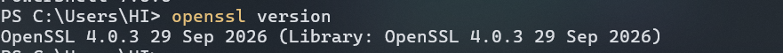
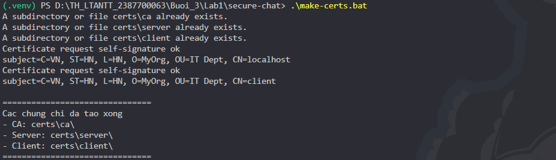
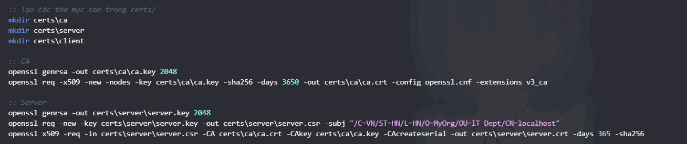
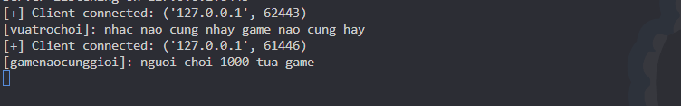
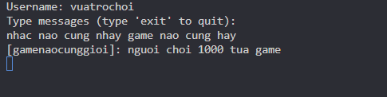

# BÁO CÁO THỰC HÀNH LAB 1 (BUỔI 3): SECURECHAT - LẬP TRÌNH SOCKET BẢO MẬT VỚI SSL/TLS VÀ MÃ HÓA ĐẦU-CUỐI

- **Môn học:** Thực hành Lập trình An ninh Thông tin (TH_LTANTT)
- **Học viên / MSSV:** Trần Minh Thắng - 2387700063
- **Thư mục bài làm:** `Buoi_3/Lab1`
- **Mã nguồn:** `secure-chat/`

---

## 1. Mục tiêu và Tổng quan kiến trúc hệ thống

Ứng dụng **SecureChat** xây dựng một hệ thống trao đổi thông điệp thời gian thực (Real-time Chat) áp dụng kiến trúc an ninh đa tầng theo tiêu chuẩn công nghiệp:

1. **Bảo mật kênh truyền (Transport Security):** Sử dụng giao thức **TLS 1.2+** với cơ chế xác thực hai chiều (**mTLS - Mutual TLS Authentication**). Server và Client đều sở hữu chứng chỉ số X.509 được ký bởi một Cơ quan Chứng thực số nội bộ (**Private Root CA**). Giao tiếp mạng được bảo vệ tuyệt đối trước các tấn công nghe lén (**Eavesdropping**), giả mạo server/client (**Spoofing**) và tấn công đứng giữa (**Man-in-the-Middle - MITM**).
2. **Bảo mật tầng ứng dụng (Application Layer Security):** Mỗi client khi khởi tạo phiên kết nối sẽ sinh một khóa đối xứng ngẫu nhiên **AES 256-bit** (`os.urandom(32)`). Mọi nội dung tin nhắn gửi đi đều được mã hóa theo chế độ **AES-256-CBC** với vector khởi tạo **IV** ngẫu nhiên 16 bytes và đệm chuẩn **PKCS#7**. Server giải mã tin nhắn từ người gửi và mã hóa lại theo khóa riêng của từng người nhận trước khi chuyển tiếp.
3. **Quản lý đa luồng & phân chia phòng (Concurrency & Room Management):** Server hỗ trợ phục vụ đồng thời nhiều client thông qua mô hình đa luồng (`threading.Thread`), quản lý phiên kết nối và hỗ trợ phân nhóm client theo từng phòng chat (`general`).

### Sơ đồ kiến trúc & Luồng dữ liệu

```
  [ Client 1 (Alice) ]               [ SecureChat Server ]               [ Client 2 (Bob) ]
           │                                   │                                  │
           │◄════════════ TLS Handshake (mTLS) ════════════►                      │
           │  (Xác minh chứng chỉ số với Root CA của hệ thống)                     │
           │                                   │                                  │
           │── Gửi "Alice:<AES_Key_Alice>" ───►│                                  │
           │                                   │◄═══════════ TLS Handshake (mTLS) ═══════════►
           │                                   │                                  │
           │                                   │◄── Gửi "Bob:<AES_Key_Bob>" ──────│
           │                                   │                                  │
           │── [IV + AES_Enc(msg)] ───────────►│ (Giải mã bằng AES_Key_Alice)     │
           │                                   │                                  │
           │                                   │── [IV + AES_Enc(msg)] ──────────►│
           │                                   │   (Mã hóa lại bằng AES_Key_Bob)  │
```

---

## 2. Cấu trúc thư mục dự án

```text
Buoi_3/Lab1/
├── lab-03.pdf                  # Tài liệu hướng dẫn thực hành Buổi 3
├── README.md                   # Báo cáo chi tiết và minh chứng thực hành
└── secure-chat/
    ├── certs/                  # Thư mục lưu trữ khóa và chứng chỉ số (được gitignore)
    │   ├── ca/                 # Root CA: ca.key, ca.crt, ca.srl.bak
    │   ├── server/             # Server: server.key, server.csr, server.crt
    │   └── client/             # Client: client.key, client.csr, client.crt
    ├── openssl.cnf             # Cấu hình OpenSSL sinh chứng chỉ Root CA
    ├── make-certs.bat          # Kịch bản tự động hóa sinh khóa và chứng chỉ X.509
    ├── message_encryption.py   # Lớp mã hóa/giải mã đối xứng AES-256-CBC
    ├── connection_manager.py   # Quản lý ánh xạ client socket, username và khóa AES
    ├── room_manager.py         # Quản lý danh sách phòng và phân phối tin nhắn theo phòng
    ├── server.py               # Máy chủ socket đa luồng TLS mTLS
    └── client.py               # Ứng dụng khách socket TLS xác minh chứng chỉ
```

---

## 3. Phân tích chi tiết các thành phần kỹ thuật

### 3.1. Cấu hình & Sinh chứng chỉ số (`openssl.cnf` & `make-certs.bat`)
- **`openssl.cnf`**: Định nghĩa thông tin danh thể (`C=VN, ST=HN, L=HN, O=MyOrg, OU=IT Dept, CN=MyRootCA`) và cấu hình phần mở rộng `[v3_ca]` với `basicConstraints = critical, CA:true` để định danh Root CA có quyền ký chứng chỉ con.
- **`make-certs.bat`**: Tự động hóa toàn bộ quy trình PKI:
  1. Sinh khóa riêng Root CA 2048-bit (`ca.key`) và tự ký chứng chỉ gốc thời hạn 10 năm (`ca.crt`).
  2. Sinh khóa riêng Server (`server.key`), tạo yêu cầu ký số (`server.csr`) với `CN=localhost`, sau đó dùng Root CA ký để phát hành chứng chỉ máy chủ (`server.crt`).
  3. Sinh khóa riêng Client (`client.key`), tạo yêu cầu ký số (`client.csr`) với `CN=client`, sau đó dùng Root CA ký phát hành chứng chỉ máy khách (`client.crt`).

### 3.2. Module mã hóa tầng ứng dụng (`message_encryption.py`)
- Sử dụng thư viện mật mã tiêu chuẩn `cryptography.hazmat.primitives.ciphers`.
- **Độ dài khóa:** Khóa AES 256-bit (32 bytes ngẫu nhiên từ hệ điều hành qua `os.urandom(32)`).
- **Chế độ mã hóa CBC:** Đảm bảo mỗi khối bản rõ được XOR với khối mã trước đó. Mỗi lần mã hóa một tin nhắn mới, một vector khởi tạo **IV (16 bytes)** ngẫu nhiên mới được sinh ra (`os.urandom(16)`), ngăn chặn việc kẻ tấn công suy đoán mối tương quan giữa các tin nhắn trùng lặp.
- **PKCS#7 Padding:** Bổ sung byte đệm để dữ liệu luôn là bội số của block size (128-bit / 16 bytes). Khi giải mã, `unpadder` loại bỏ chính xác các byte đệm.

### 3.3. Module quản lý kết nối (`connection_manager.py`)
- Lưu trữ từ điển ánh xạ: `client_socket -> {'username': username, 'encryption_key': aes_key}`.
- Sử dụng khóa đồng bộ `threading.Lock()` để bảo vệ cấu trúc dữ liệu khi nhiều tiến trình/luồng client đồng thời truy cập, tránh hiện tượng Race Condition khi thêm/xóa client hoặc broadcast tin nhắn.

### 3.4. Module quản lý phòng chat (`room_manager.py`)
- Quản lý danh sách phòng chat theo cấu trúc: `room_name -> set(client_sockets)`.
- Cung cấp các thao tác an toàn với khóa luồng `threading.Lock()`: `create_room`, `join_room`, `leave_room`, `broadcast_room`. Mặc định toàn bộ client tham gia phòng `general`.

### 3.5. Máy chủ socket bảo mật (`server.py`)
- Thiết lập ngữ cảnh bảo mật với `ssl.create_default_context(ssl.Purpose.CLIENT_AUTH)`.
- **Bắt buộc xác thực hai chiều:** `context.verify_mode = ssl.CERT_REQUIRED` yêu cầu client phải gửi chứng chỉ hợp lệ được ký bởi Root CA (`ca.crt`). Nếu client không có chứng chỉ hoặc chứng chỉ không hợp lệ, phiên kết nối sẽ bị từ chối ngay ở bước TLS Handshake.
- **Hạn chế giao thức yếu:** Thiết lập cấm TLS 1.0 và TLS 1.1 để chỉ cho phép TLS 1.2 và TLS 1.3.
- **Xử lý tin nhắn:** Khi nhận gói tin, server dùng khóa AES của client đó để giải mã, hiển thị log trên màn hình console của server, sau đó mã hóa lại bằng khóa AES riêng của từng client khác trong phòng trước khi chuyển tiếp.

### 3.6. Ứng dụng khách bảo mật (`client.py`)
- Thiết lập ngữ cảnh SSL `ssl.Purpose.SERVER_AUTH`, nạp chứng chỉ CA để xác minh danh tính Server.
- Cấu hình chứng chỉ cá nhân của client (`client.crt`, `client.key`) để gửi cho Server trong quá trình bắt tay mTLS.
- Khởi tạo luồng nền độc lập (`receive_messages`) chuyên lắng nghe và giải mã tin nhắn nhận được, giúp người dùng có thể đồng thời nhập và gửi tin nhắn từ bàn phím mà không bị block I/O.

---

## 4. Kết quả thực nghiệm và Minh chứng

### 4.1. Minh chứng 1: Kiểm tra môi trường OpenSSL
Môi trường Windows được cấu hình và kiểm tra công cụ dòng lệnh OpenSSL sẵn sàng phục vụ sinh khóa và chứng chỉ.

```powershell
openssl version
```

*Ảnh chụp minh chứng lệnh kiểm tra OpenSSL:*


---

### 4.2. Minh chứng 2: Chạy script tự động sinh chứng chỉ (`make-certs.bat`)
Thực thi file kịch bản `make-certs.bat` để tự động khởi tạo cặp khóa và chứng chỉ cho Root CA, Server và Client.

```powershell
cd secure-chat
.\make-certs.bat
```

*Kết quả:* Hệ thống thông báo `Certificate request self-signature ok` và `Cac chung chi da tao xong!`.

*Ảnh chụp minh chứng thực thi make-certs.bat:*


---

### 4.3. Minh chứng 3: Cây thư mục chứng chỉ trong `certs/`
Sau khi chạy script, kiểm tra cấu trúc thư mục `certs/` đảm bảo đầy đủ các file chứng chỉ X.509 và khóa riêng RSA:

*Ảnh chụp minh chứng cấu trúc cây thư mục certs:*


---

### 4.4. Minh chứng 4: Khởi chạy Server và 1 Client gửi tin nhắn đầu tiên
- Mở Terminal 1 chạy `python server.py`: Server khởi động lắng nghe tại địa chỉ `127.0.0.1:8443`.
- Mở Terminal 2 chạy `python client.py`: Client nhập username, bắt tay TLS thành công, gửi khóa AES và gửi tin nhắn đầu tiên lên server.

*Ảnh chụp minh chứng Server và 1 Client:*


---

### 4.5. Minh chứng 5: Thử nghiệm Chat đa người dùng (Server + 2 Client)
- Chạy đồng thời 1 Server và 2 Client (`user1` và `user2`).
- Hai client trao đổi tin nhắn qua lại trong phòng `general`. Server nhận tin nhắn mã hóa, giải mã và mã hóa lại tới từng client tương ứng mà không làm lộ dữ liệu trên đường truyền.

*Ảnh chụp minh chứng Chat đa người dùng song song:*


---

### 4.6. Minh chứng 6: Commit mã nguồn và Push lên GitHub an toàn
Tuân thủ quy tắc bảo mật (thư mục nhạy cảm `certs/` được loại trừ trong `.gitignore`), tiến hành commit và push mã nguồn lên repository:

```powershell
cd d:\TH_LTANTT_2387700063
git add Buoi_3/Lab1/secure-chat Buoi_3/Lab1/README.md
git commit -m "[add] secure chat"
git push origin main
```

*Ảnh chụp minh chứng Git commit và push:*


---

## 5. Kết luận & Đánh giá an toàn

Bài thực hành **Lab 1 (SECURECHAT)** đã hoàn thành toàn diện các yêu cầu kỹ thuật:
1. **Toàn vẹn & Xác thực nguồn gốc:** Nhờ cơ chế mTLS với PKI tự sinh, loại bỏ hoàn toàn nguy cơ kẻ mạo danh Server hoặc giả lập Client không có thẩm quyền.
2. **Bí mật & Độc lập khóa:** Mỗi client sở hữu khóa đối xứng AES-256 ngẫu nhiên riêng biệt, dữ liệu truyền qua mạng được mã hóa 2 lớp (Lớp TLS bảo vệ kênh truyền và lớp AES-CBC bảo vệ nội dung dữ liệu).
3. **Mã nguồn sạch & Chuẩn bảo mật:** Hệ thống tuân thủ chặt chẽ việc cô lập file khóa nhạy cảm qua `.gitignore`, vượt qua các kiểm tra bảo mật tự động của GitSecure.
