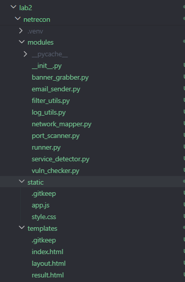
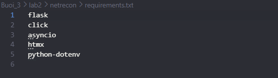
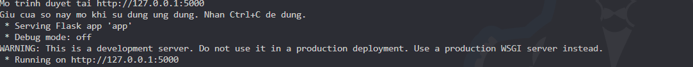
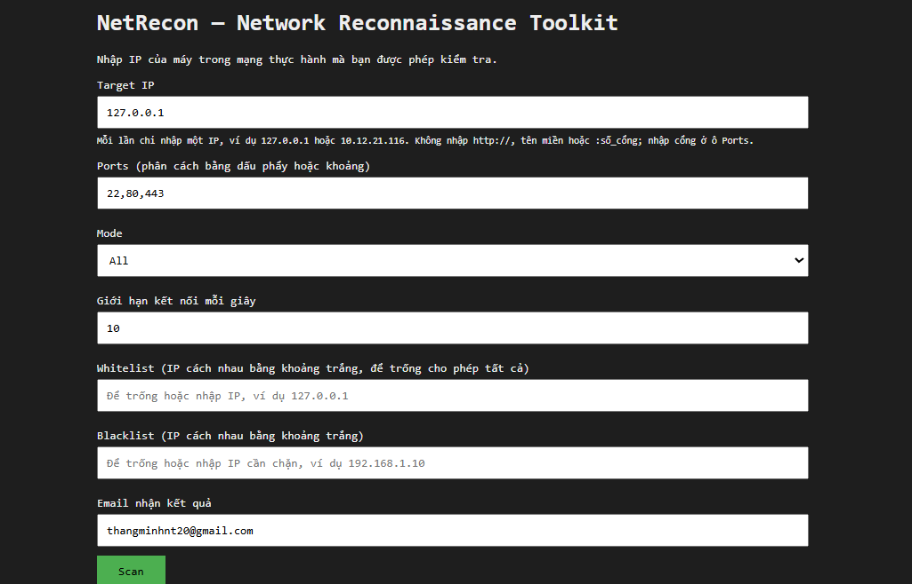
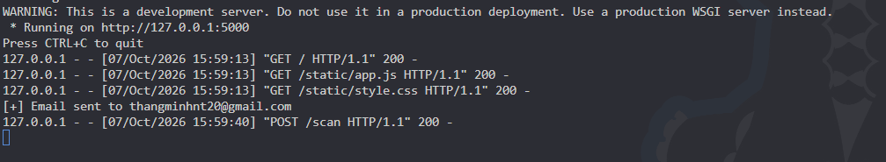
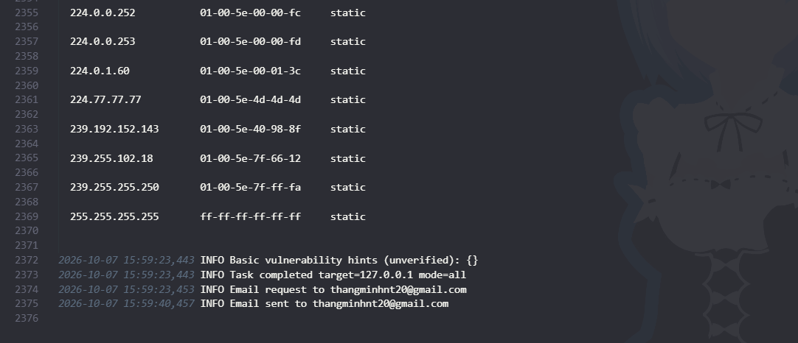
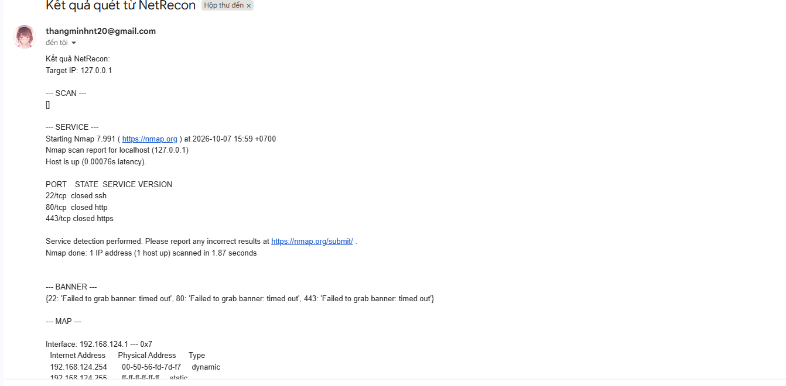

# BÁO CÁO THỰC HÀNH LAB2 — NETRECON

- **Môn học:** Thực hành Lập trình An ninh Thông tin (TH_LTANTT)
- **Học viên / MSSV:** Trần Minh Thắng - 2387700063
- **Người thực hiện:** Trần Minh Thắng
- **Thư mục bài làm:** `Buoi_3/Lab2`

## 1. Mục tiêu bài thực hành

Xây dựng bộ công cụ NetRecon để khám phá mạng trong môi trường thực hành: quét cổng, phát hiện dịch vụ, lấy banner, đọc thông tin mạng và tra cứu gợi ý lỗ hổng. Công cụ có giao diện web, CLI, giới hạn tốc độ, ghi log có thời gian và lọc mục tiêu bằng whitelist/blacklist.

## 2. Các công việc đã thực hiện

### 2.1. Tạo cấu trúc mã nguồn

Đã tạo thư mục `netrecon` trong thư mục bài làm với cấu trúc chính:

```text
Lab2/
├── README.md                   # Báo cáo thực hành và hướng dẫn minh chứng
├── .gitignore                  # Bỏ qua .env, môi trường ảo, log và cache
└── netrecon/
    ├── app.py                  # Ứng dụng Flask
    ├── cli.py                  # CLI dùng Click
    ├── requirements.txt        # Danh sách thư viện theo tài liệu
    ├── constraints.txt         # Giới hạn phiên bản phụ thuộc tương thích
    ├── .env                    # Cấu hình SMTP riêng trên máy
    ├── .env.example            # Mẫu cấu hình không chứa mật khẩu
    ├── README.md               # Hướng dẫn chạy nhanh
    ├── test_app.py             # Kiểm tra tự động
    ├── modules/
    │   ├── __init__.py
    │   ├── port_scanner.py
    │   ├── service_detector.py
    │   ├── banner_grabber.py
    │   ├── network_mapper.py
    │   ├── vuln_checker.py
    │   ├── email_sender.py
    │   ├── filter_utils.py
    │   ├── log_utils.py
    │   └── runner.py
    ├── templates/
    │   ├── layout.html
    │   ├── index.html
    │   └── result.html
    └── static/
        ├── style.css
        └── app.js
```

Môi trường ảo `.venv` đã được tạo tại `netrecon/.venv`. File `netrecon.log` được tạo khi sử dụng các module ghi log.

### 2.2. Cài thư viện

Đã cài `flask`, `click`, `asyncio`, `htmx`, `python-dotenv` và các phụ thuộc vào môi trường ảo. Bổ sung `constraints.txt` để các phụ thuộc của gói `htmx` tương thích với Pydantic 1. Giao diện hiện cập nhật kết quả bằng JavaScript cục bộ trong `static/app.js`.

### 2.3. Xây dựng các module

- **PortScanner:** Quét TCP bằng `asyncio.open_connection`, có timeout, đóng kết nối sau khi kiểm tra và trả về danh sách cổng mở. Giãn thời gian bắt đầu kết nối theo `rate_limit` và giới hạn số kết nối đồng thời.
- **ServiceDetector:** Gọi Nmap với `-sV`, danh sách cổng và `--max-rate`; trả về kết quả hoặc thông báo lỗi. Cần có Nmap trong PATH để sử dụng.
- **BannerGrabber:** Nhận tối đa 1.024 byte từ kết nối TCP, timeout 2 giây, xử lý lỗi giải mã và đóng socket bằng context manager. Chỉ đọc banner, không gửi yêu cầu giao thức.
- **NetworkMapper:** Đọc bảng ARP cục bộ bằng lệnh `arp -a` và ghi kết quả vào log.
- **VulnChecker:** Tra cứu danh sách CVE minh họa theo cổng trong tài liệu. Với chế độ `all`, dùng danh sách cổng mở từ kết quả quét để đưa ra gợi ý.
- **FilterUtils:** Lọc mục tiêu theo whitelist và blacklist; blacklist được ưu tiên nếu một IP có trong cả hai danh sách.
- **LogUtils:** Ghi hoạt động, kết quả và lỗi kèm thời gian vào `netrecon/netrecon.log`.
- **Runner:** Điều phối các module, kiểm tra IP, chế độ, giới hạn tốc độ và danh sách cổng; áp dụng lọc mục tiêu trước khi thực hiện tác vụ.
- **EmailSender:** Gửi kết quả qua Gmail SMTP SSL, cổng 465; xử lý lỗi và trả về trạng thái gửi.

### 2.4. Giao diện web và CLI

Ứng dụng Flask có trang nhập IP, cổng, chế độ, giới hạn tốc độ, whitelist, blacklist và email nhận kết quả. Các chế độ gồm `all`, `scan`, `service`, `banner`, `map`, `vuln`. Kết quả hiển thị tại cùng trang sau khi xử lý.

CLI hỗ trợ các tùy chọn tương ứng; danh sách cổng có thể nhập theo dạng `22,80,443` hoặc khoảng như `20-25,80`. Giới hạn tối đa 1.024 cổng mỗi tác vụ. CLI hiện in kết quả ra terminal và không gửi email.

### 2.5. Cấu hình email

Email nhận kết quả mặc định trên web đã được đặt là **thangminhnt20@gmail.com**. Người dùng có thể sửa trường email trước khi chạy tác vụ.

Ứng dụng đọc `SMTP_USER` và `SMTP_PASS` từ `netrecon/.env`. Sau mỗi tác vụ web, ứng dụng thông báo gửi thành công, gửi thất bại hoặc thiếu cấu hình SMTP. File `.env` được loại khỏi Git để không đưa thông tin đăng nhập vào mã nguồn.

**Trạng thái:** Chưa cấu hình tài khoản gửi và chưa xác minh gửi email thật. Cần điền Gmail gửi và mật khẩu ứng dụng Gmail. Chuỗi `Netrecon` nêu trong đề không được dùng thay cho mật khẩu ứng dụng Gmail do Google cấp. Việc tạo mật khẩu ứng dụng trong tài khoản Google chưa được thực hiện trong phiên làm việc này.

## 3. Kiểm tra đã thực hiện

Đã kiểm tra cú pháp Python, chạy 6 kiểm tra tự động và kiểm tra phụ thuộc bằng `pip check`.

Sáu kiểm tra đều đạt:

1. Trang chủ chứa đúng email nhận mặc định và tải được file JavaScript.
2. Luồng gửi email dùng đúng địa chỉ `thangminhnt20@gmail.com` khi không nhập địa chỉ khác.
3. Thiếu cấu hình SMTP thì không gọi hàm gửi email và hiển thị thông báo.
4. Gửi email thất bại thì hiển thị trạng thái thất bại.
5. Mục tiêu thuộc blacklist bị chặn trước khi quét và gửi email.
6. Phân tích khoảng cổng đúng, từ chối khoảng quá lớn và rate limit không hợp lệ.

Kết quả kiểm tra tự động: `Ran 6 tests` và `OK`. Kết quả kiểm tra phụ thuộc: `No broken requirements found.` Các kiểm tra email dùng giả lập, không gửi thư thật. Các ảnh chạy trực tiếp dưới đây cần người thực hiện tự chụp sau khi chạy trên máy.

## 4. Phạm vi và các phần chưa hoàn thành

- Quét cổng hiện là **TCP connect**. Quét UDP và kỹ thuật quét ẩn mình trong yêu cầu tổng quát chưa được triển khai.
- NetworkMapper hiển thị bảng ARP, chưa vẽ sơ đồ mạng hoặc thực hiện khám phá toàn mạng.
- VulnChecker chỉ đưa ra gợi ý theo cổng; chưa đối chiếu sản phẩm, phiên bản và điều kiện để xác nhận một CVE.
- Máy chưa có `nmap` trong PATH tại thời điểm kiểm tra. Chưa xác minh ServiceDetector với Nmap thật.
- Chưa xác minh gửi email thật do chưa có cấu hình SMTP.
- Đã kiểm tra logic cấu hình rate limit; chưa đo thông lượng thực tế bằng công cụ bắt gói.

## 5. Hướng dẫn chạy

Các lệnh sau chạy trong PowerShell tại thư mục bài làm:

```powershell
Set-Location 'D:\TH_LTANTT_2387700063\Buoi_3\lab2'
```

### 5.1. Kiểm tra và cài thư viện

Môi trường `.venv` đã được tạo. Nếu cần cài lại các thư viện:

```powershell
.\netrecon\.venv\Scripts\python.exe -m pip install -r .\netrecon\requirements.txt -c .\netrecon\constraints.txt
.\netrecon\.venv\Scripts\python.exe -m pip check
```

### 5.2. Chạy ứng dụng web

Cách nhanh: nhấp đúp `netrecon/run_app.cmd`. File này dùng Python của môi trường ảo, không yêu cầu lệnh `python` trong PATH. Hoặc dùng lệnh PowerShell bên dưới.

```powershell
.\netrecon\.venv\Scripts\python.exe .\netrecon\app.py
```

Giữ terminal này mở. Truy cập **http://127.0.0.1:5000** trên trình duyệt. Dùng IP `127.0.0.1` để kiểm tra chính máy đang chạy ứng dụng. Chỉ dùng IP khác khi đó là máy trong môi trường thực hành được phép kiểm tra.

### 5.3. Chạy CLI

Mở terminal thứ hai trong cùng thư mục bài làm:

```powershell
.\netrecon\.venv\Scripts\python.exe .\netrecon\cli.py --help
.\netrecon\.venv\Scripts\python.exe .\netrecon\cli.py --target 127.0.0.1 --ports 5000 --mode scan --rate-limit 2
```

Khi Flask đang chạy, dự kiến có kết quả `[+] 5000/tcp open` và danh sách cổng mở chứa `5000`.

### 5.4. Chạy kiểm tra tự động

```powershell
.\netrecon\.venv\Scripts\python.exe -m unittest netrecon.test_app -v
```

### 5.5. Cấu hình SMTP nếu cần minh chứng email thật

Mở `netrecon/.env` và điền trên máy:

```dotenv
SMTP_USER=dia_chi_gmail_gui
SMTP_PASS=mat_khau_ung_dung_gmail
```

Sau khi lưu, app tự đọc lại `.env` ở lần gửi kết quả tiếp theo. Trên web, chạy tác vụ với email nhận **thangminhnt20@gmail.com**. Không chụp hoặc đưa mật khẩu thật vào báo cáo.

## 6. Hướng dẫn chụp ảnh minh chứng

Tạo thư mục lưu ảnh tại thư mục bài làm:

```powershell
New-Item -ItemType Directory -Path .\minh_chung -Force
```

Dùng `Win + Shift + S` để chụp vùng có nội dung cần minh chứng rồi lưu theo tên gợi ý. Ảnh cần rõ chữ, có ngữ cảnh tên ứng dụng hoặc lệnh đã chạy. Không dùng kết quả giả lập để khẳng định đã gửi email thật hoặc đã xác nhận CVE.

### Ảnh 01 — Cấu trúc mã nguồn
- 
- Chú thích: **Cấu trúc mã nguồn bộ công cụ NetRecon trong Lab2.**

### Ảnh 02 — Thư viện đã cài
- 
- Chú thích: **Thư viện đã được cài trong môi trường ảo và không có xung đột phụ thuộc được pip phát hiện.**

### Ảnh 03 — Khởi động Flask
- 
- Chú thích: **Ứng dụng Flask chạy trên máy cục bộ tại cổng 5000.**

### Ảnh 04 — Giao diện và email mặc định

- Chú thích: **Giao diện nhập tham số và email nhận kết quả mặc định.**

### Ảnh 05 — Quét TCP trên web

- Chú thích: **Phát hiện cổng TCP 5000 đang mở trên máy chạy Flask.**

### Ảnh 06— Log có thời gian
- 
- Chú thích: **Ghi log hoạt động và kết quả có dấu thời gian.**

### Ảnh 07 — Trạng thái email hoặc email thật

- **Khi chưa cấu hình SMTP:** Chụp kết quả tác vụ có thông báo thiếu `SMTP_USER` và `SMTP_PASS`. Lưu `minh_chung/11a_email_chua_cau_hinh.png`.
- **Khi đã cấu hình SMTP:** Lưu `.env`, chọn Mode `Vulnerability Check`, Ports `80`, để email nhận **thangminhnt20@gmail.com**, rồi bấm **Scan**. Chụp thông báo đã gửi và mở hộp thư nhận để chụp thư có tiêu đề **Kết quả quét từ NetRecon**, địa chỉ nhận và nội dung kết quả. Kiểm tra cả thư mục Spam nếu chưa thấy thư.
-
- Chú thích phù hợp: **Ứng dụng báo thiếu cấu hình SMTP** hoặc **Gửi và nhận kết quả NetRecon qua email thành công**. Chỉ dùng chú thích thành công khi đã nhận được thư thật.
## 7. Nhận xét

Đã xây dựng cấu trúc dự án, các module cơ bản, giao diện web/CLI, cơ chế ghi log, lọc mục tiêu và luồng thông báo email. Các kiểm tra tự động đã đạt. Những nội dung cần tiếp tục bổ sung gồm quét UDP, kỹ thuật quét ẩn mình, sơ đồ mạng trực quan và xác minh CVE theo dịch vụ/phiên bản. Minh chứng thực nghiệm cần được chụp từ kết quả chạy thật trên máy, đồng thời ghi đúng các giới hạn môi trường và trạng thái SMTP/Nmap.
